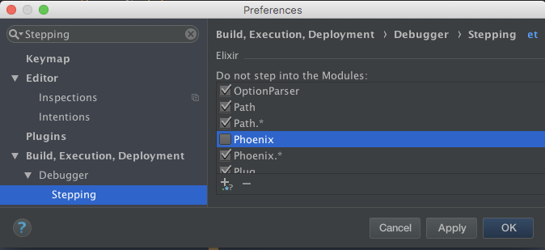
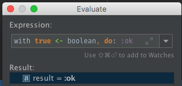
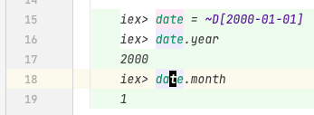
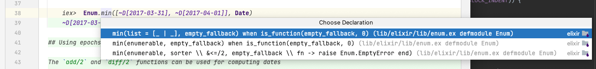
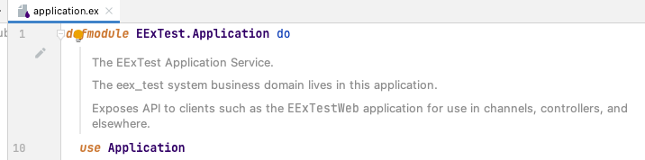
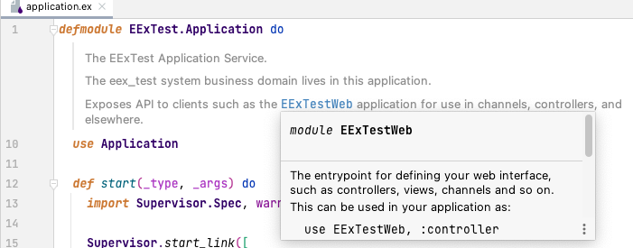
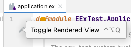
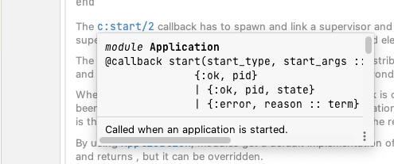
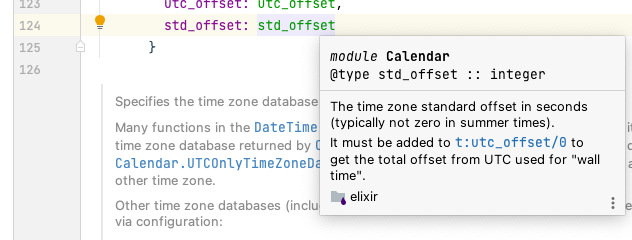

Table of Contents[](#backers)[](#sponsors)
=================

   * [Elixir plugin](#elixir-plugin)
      * [IDEs](#ides)
      * [Features](#features)
         * [Project](#project)
            * [From Existing Sources](#from-existing-sources)
               * [Import project from external model](#import-project-from-external-model)
               * [Create project from existing sources](#create-project-from-existing-sources)
            * [New](#new)
         * [Project Structure](#project-structure)
         * [Project Settings](#project-settings)
         * [Module Settings](#module-settings)
            * [Sources](#sources)
            * [Paths](#paths)
            * [Dependencies](#dependencies)
         * [New Elixir File](#new-elixir-file)
            * [Empty module](#empty-module)
            * [Elixir Application](#elixir-application)
            * [Elixir Supervisor](#elixir-supervisor)
            * [Elixir GenServer](#elixir-genserver)
            * [Elixir GenEvent](#elixir-genevent)
         * [Syntax Highlighting and Semantic Annotation](#syntax-highlighting-and-semantic-annotation)
         * [Grammar parsing](#grammar-parsing)
         * [Inspections](#inspections)
            * [Ambiguous nested calls](#ambiguous-nested-calls)
            * [Ambiguous parentheses](#ambiguous-parentheses)
               * [Empty Parentheses](#empty-parentheses)
               * [Keywords in Parentheses](#keywords-in-parentheses)
               * [Positional arguments in Parentheses](#positional-arguments-in-parentheses)
            * [Keyword pair colon (:) used in type spec instead of type operator (<code>::</code>)](#keyword-pair-colon--used-in-type-spec-instead-of-type-operator-)
            * [Keywords appear before the end of list.](#keywords-appear-before-the-end-of-list)
            * [Match operator (=) used in type spec instead of type operator (<code>::</code>)](#match-operator--used-in-type-spec-instead-of-type-operator-)
         * [Quick Fixes](#quick-fixes)
            * [Convert : to <code> ::</code> in type specs](#convert--to---in-type-specs)
            * [Convert = to <code> ::</code> in type specs](#convert--to---in-type-specs-1)
            * [Remove space in front of ambiguous parentheses](#remove-space-in-front-of-ambiguous-parentheses)
         * [Code Folding](#code-folding)
            * [Controls](#controls)
               * [Collapsing](#collapsing)
               * [Expanding](#expanding)
            * [Regions](#regions)
         * [Commenter](#commenter)
         * [Credo](#credo)
            * [Annotator](#annotator)
               * [Enable](#enable)
               * [Disable](#disable)
            * [Inspection](#inspection)
               * [Batch Mode](#batch-mode)
            * [Configuration](#configuration)
         * [Debugger](#debugger)
            * [Steps](#steps)
            * [Basics](#basics)
               * [Keyboard Shortcuts](#keyboard-shortcuts)
               * [Excluding Modules](#excluding-modules)
                  * [Disabling Existing Module Patterns](#disabling-existing-module-patterns)
                  * [Editing Existing Module Patterns](#editing-existing-module-patterns)
                  * [Removing Existing Module Patterns](#removing-existing-module-patterns)
                  * [Adding New Module Patterns](#adding-new-module-patterns)
               * [Environment Variables](#environment-variables)
            * [Breakpoints](#breakpoints)
               * [Accessing Breakpoint Properties](#accessing-breakpoint-properties)
                  * [Viewing all breakpoints](#viewing-all-breakpoints)
                  * [Viewing a single breakpoint](#viewing-a-single-breakpoint)
               * [Configuring Breakpoints](#configuring-breakpoints)
               * [Creating Line Breakpoints](#creating-line-breakpoints)
               * [Describing Line Breakpoints](#describing-line-breakpoints)
               * [Searching for Line Breakpoints](#searching-for-line-breakpoints)
               * [Jump to Breakpoint Source](#jump-to-breakpoint-source)
               * [Disabling Line Breakpoints](#disabling-line-breakpoints)
               * [Deleting Line Breakpoints](#deleting-line-breakpoints)
            * [Starting the Debugger Session](#starting-the-debugger-session)
            * [Examining Suspended Program](#examining-suspended-program)
               * [Processes](#processes)
               * [Frames](#frames)
                  * [Jump to Current Execution Point](#jump-to-current-execution-point)
               * [Variables](#variables)
            * [Evaluate](#evaluate)
            * [Stepping](#stepping)
         * [Delimiters](#delimiters)
            * [Auto-inserting](#auto-inserting)
            * [Matching](#matching)
         * [Dialyzer](#dialyzer)
           * [Inspection](#inspection-1)
         * [Embedded Elixir (EEx) Templates <a href="/resources/icons/file/eex.svg" target="_blank" rel="noopener noreferrer"></a>](#embedded-elixir-eex-templates-)
            * [Advanced configuration](#advanced-configuration)
         * [Live Embedded Elixir (LEEx) Templates <a href="/resources/icons/file/eex.svg" target="_blank" rel="noopener noreferrer"></a>](#live-embedded-elixir-leex-templates-)
            * [Advanced configuration](#advanced-configuration-1)
         * [Building/Compiling](#buildingcompiling)
            * [Settings](#settings)
            * [Build Messages](#build-messages)
               * [Jump To Source](#jump-to-source)
               * [Warnings as Errors](#warnings-as-errors)
            * [Individual File](#individual-file)
            * [Project](#project-1)
         * [Live Templates](#live-templates)
         * [Documentation](#documentation)
           * [Rendered View](#rendered-view)
           * [Quick Documentation](#quick-documentation)
         * [Run/Debug Configurations](#rundebug-configurations)
            * [Distillery Release CLI <a href="resources/icons/run/distillery/release-cli.svg" target="_blank" rel="noopener noreferrer"></a>](#distillery-release-cli-)
               * [Running](#running)
               * [Debugging](#debugging)
            * [Elixir <a href="/resources/icons/run/elixir.svg" target="_blank" rel="noopener noreferrer"></a>](#elixir-)
               * [Running](#running-1)
               * [Debugging](#debugging-1)
            * [IEx (Interactive Elixir) <a href="/resources/icons/run/iex.svg" target="_blank" rel="noopener noreferrer"></a>](#iex-interactive-elixir-)
               * [Running](#running-2)
               * [Debugging](#debugging-2)
            * [Mix Tasks <a href="/resources/icons/run/mix.svg" target="_blank" rel="noopener noreferrer"></a>](#mix-tasks-)
               * [Running](#running-3)
               * [Debugging](#debugging-3)
            * [IEx Mix <a href="/resources/icons/run/iex/mix.svg" target="_blank" rel="noopener noreferrer"></a>](#iex-mix-)
               * [Running](#running-4)
               * [Debugging](#debugging-4)
            * [mix espec <a href="/resources/icons/run/mix/test.svg" target="_blank" rel="noopener noreferrer"></a>](#mix-espec-)
               * [Using graphical formatter](#using-graphical-formatter)
               * [Creating mix espce Run Configurations Manually](#creating-mix-espce-run-configurations-manually)
               * [Running](#running-5)
               * [Debugging](#debugging-5)
               * [Creating mix espec Run Configurations from context](#creating-mix-espec-run-configurations-from-context)
                  * [Creating/Running mix espec Run Configurations from directory](#creatingrunning-mix-espec-run-configurations-from-directory)
                  * [Creating/Running mix espec Run Configurations from file](#creatingrunning-mix-espec-run-configurations-from-file)
                  * [Creating/Running mix espec Run Configurations from line](#creatingrunning-mix-espec-run-configurations-from-line)
            * [mix test <a href="/resources/icons/run/mix/test.svg" target="_blank" rel="noopener noreferrer"></a>](#mix-test-)
               * [Creating mix test Run Configurations Manually](#creating-mix-test-run-configurations-manually)
               * [Running](#running-6)
               * [Debugging](#debugging-6)
               * [Creating mix test Run Configurations from context](#creating-mix-test-run-configurations-from-context)
                  * [Creating/Running mix test Run Configurations from directory](#creatingrunning-mix-test-run-configurations-from-directory)
                  * [Creating/Running mix test Run Configurations from file](#creatingrunning-mix-test-run-configurations-from-file)
                  * [Creating/Running mix test Run Configurations from line](#creatingrunning-mix-test-run-configurations-from-line)
         * [.beam Files](#beam-files)
            * [Decompression](#decompression)
            * [BEAM Chunks](#beam-chunks)
               * [Atom / <code>AtU8</code>](#atom--atu8)
                  * [Format](#format)
                  * [Tab](#tab)
               * [Attr](#attr)
                  * [Format](#format-1)
                  * [Tab](#tab-1)
               * [CInf](#cinf)
                  * [Format](#format-2)
                  * [Tab](#tab-2)
               * [Code](#code)
                  * [Format](#format-3)
                  * [Tab](#tab-3)
               * [Dbgi](#dbgi)
                  * [Format](#format-4)
                  * [Tab](#tab-4)
               * [ExDc](#exdc)
                  * [Format](#format-5)
                  * [Tab](#tab-5)
               * [ExpT](#expt)
                  * [Format](#format-6)
                  * [Tab](#tab-6)
               * [ImpT](#impt)
                  * [Format](#format-7)
                  * [Tab](#tab-7)
               * [LitT](#litt)
                  * [Format](#format-8)
                  * [Tab](#tab-8)
               * [Line](#line)
                  * [Format](#format-9)
                  * [Tab](#tab-9)
               * [LocT](#loct)
                  * [Format](#format-10)
                  * [Tab](#tab-10)
               * [StrT](#strt)
                  * [Format](#format-11)
                  * [Tab](#tab-11)
            * [Decompilation (Text)](#decompilation-text)
               * [Call definition macros](#call-definition-macros)
                  * [defp with <code>/</code> in name](#defp-with--in-name)
               * [Special handling of call definition names](#special-handling-of-call-definition-names)
         * [Completion](#completion)
            * [Aliases and Modules](#aliases-and-modules)
               * [Aliases inside { }](#aliases-inside--)
            * [Function and Macro Calls](#function-and-macro-calls)
               * [Qualified](#qualified)
               * [Unqualified](#unqualified)
            * [Module Attributes](#module-attributes)
            * [Parameters and Variables](#parameters-and-variables)
         * [Go To Declaration](#go-to-declaration)
            * [Alias](#alias)
            * [Function or Macro](#function-or-macro)
               * [Imported Functions or Macros](#imported-functions-or-macros)
               * [Local Functions or Macros](#local-functions-or-macros)
               * [Remote Functions or Macros](#remote-functions-or-macros)
            * [Module](#module)
            * [Module Attribute](#module-attribute)
            * [Parameters and Variables](#parameters-and-variables-1)
         * [Formatting](#formatting)
            * [Directory](#directory)
            * [File](#file)
               * [Other File](#other-file)
               * [Current File](#current-file)
            * [Selection](#selection)
         * [Go To Related](#go-to-related)
            * [Decompiled Module](#decompiled-module)
            * [Decompiled Call Definition](#decompiled-call-definition)
         * [Go To Symbol](#go-to-symbol)
         * [Go To Test](#go-to-test)
         * [Go To Test Subject](#go-to-test-subject)
         * [Find Usages and Show Usages](#find-usages-and-show-usages)
            * [Function](#function)
            * [Module](#module-1)
            * [Module Attribute](#module-attribute-1)
            * [Parameters and Variables](#parameters-and-variables-2)
         * [Refactor](#refactor)
            * [Rename](#rename)
               * [Module Attribute](#module-attribute-2)
               * [Parameters and Variables](#parameters-and-variables-3)
         * [SDK](#sdk)
            * [Package Manager Install Locations](#package-manager-install-locations)
            * [Rich IDEs](#rich-ides)
               * [Default SDK](#default-sdk)
            * [Small IDEs](#small-ides)
               * [Elixir Facet SDK](#elixir-facet-sdk)
               * [Elixir SDKs](#elixir-sdks)
               * [Internal Erlang SDK](#internal-erlang-sdk)
         * [Show Parameters](#show-parameters)
         * [Structure](#structure)
            * [Viewing Structure](#viewing-structure)
            * [Buttons](#buttons)
               * [Sorters](#sorters)
               * [Providers](#providers)
               * [Expanders](#expanders)
               * [Autoscrollers](#autoscrollers)
            * [Elements](#elements)
               * [Icons](#icons)
                  * [Time](#time)
                  * [Visibility](#visibility)
               * [Call to Element](#call-to-element)
      * [Installation](#installation)
         * [Stable releases](#stable-releases)
            * [Inside IDE using JetBrains repository](#inside-ide-using-jetbrains-repository)
            * [Inside IDE using Github releases](#inside-ide-using-github-releases)
               * [In browser](#in-browser)
               * [In IDE](#in-ide)
         * [Canary releases](#canary-releases)
            * [Inside IDE using JetBrains repository](#inside-ide-using-jetbrains-repository-1)
            * [Inside IDE using Github releases](#inside-ide-using-github-releases-1)
               * [In browser](#in-browser-1)
               * [In IDE](#in-ide-1)
      * [Screenshots](#screenshots)
      * [Error reporting](#error-reporting)
      * [Contributors](#contributors)
      * [Donations](#donations)
         * [Work Time](#work-time)
         * [Donors](#donors)
         * [Patrons](#patrons)
         * [Backers](#backers)
         * [Sponsors](#sponsors)

# Elixir plugin

[](https://travis-ci.org/KronicDeth/intellij-elixir)

This is a plugin that adds support for [Elixir](http://elixir-lang.org/) to JetBrains IDEs.

The plugin works both in the rich IDEs that allow alternative language SDK selection and small IDEs that are language specific.  The rich IDEs work best for IntelliJ Elixir because only in the rich IDEs can have an Elixir SDK set as the Project SDK.  In all small IDEs, the native language SDK is always there, which makes anything that uses the SDK, such as running `elixir`, `erl`, or `mix` more complicated both internally and externally in the configuration you have to setup.

## IDEs

*The plugin is free to use in all JetBrains IDEs.  The Cost column in the below table is what JetBrains charges for the IDE itself.  IntelliJ Elixir is maintained by [@KronicDeth](https://github.com/KronicDeth) who does not get any of the subscription money.  If you want to support the plugin itself, make a [donation](#donations).*

| IDE                                                                                                      | Rich/Small | Languages   | Cost                                                                      | Trial                                                                                | License              | Source                                                                                                          |
|----------------------------------------------------------------------------------------------------------|------------|-------------|---------------------------------------------------------------------------|--------------------------------------------------------------------------------------|----------------------|-----------------------------------------------------------------------------------------------------------------|
| [IntelliJ IDEA Community Edition](https://www.jetbrains.com/idea/download/download-thanks.html?code=IIC) | Rich       | Java        | Free                                                                      | N/A                                                                                  | Apache 2.0           | [JetBrains/intellij-community](https://github.com/JetBrains/intellij-community)                                 |
| [IntelliJ IDEA Ultimate Edition](https://www.jetbrains.com/idea/download/download-thanks.html)           | Rich       | Java        | [Subscription](https://www.jetbrains.com/idea/buy/#edition=discounts)     | 30-days                                                                              | Commercial           | N/A                                                                                                             |
| [AppCode](https://www.jetbrains.com/objc/download/download-thanks.html)                                  | Small      | Objective-C | [Subscription](https://www.jetbrains.com/objc/buy/#edition=discounts)     | 30-days                                                                              | Commercial           | N/A                                                                                                             |
| [CLion](https://www.jetbrains.com/clion/download/download-thanks.html)                                   | Small      | C/C++       | [Subscription](https://www.jetbrains.com/clion/buy/#edition=discounts)    | 30-days                                                                              | Commercial           | N/A                                                                                                             |
| [DataGrip](https://www.jetbrains.com/datagrip/download/download-thanks.html)                             | Small      | SQL         | [Subscription](https://www.jetbrains.com/datagrip/buy/#edition=discounts) | 30-days                                                                              | Commercial           | N/A                                                                                                             |
| [GoLand](https://www.jetbrains.com/go/download/download-thanks.html)                                     | Small      | Go          | [Subscription](https://www.jetbrains.com/goland/buy/#edition=discounts)   | 30-days                                                                              | Commercial           | N/A                                                                                                             |
| [PHPStorm](https://www.jetbrains.com/phpstorm/download/download-thanks.html)                             | Small      | PHP         | [Subscription](https://www.jetbrains.com/phpstorm/buy/#edition=discounts) | 30-days                                                                              | Commercial           | N/A                                                                                                             |
| [PyCharm Community Edition](https://www.jetbrains.com/pycharm/download/download-thanks.html?code=PCC)    | Small      | Python      | Free                                                                      | N/A                                                                                  | Apache 2.0           | [JetBrains/intellij-community subdirectory](https://github.com/JetBrains/intellij-community/tree/master/python) |
| [PyCharm Professional Edition](https://www.jetbrains.com/pycharm/download/download-thanks.html)          | Small      | Python      | [Subscription](https://www.jetbrains.com/pycharm/buy/#edition=discounts)  | N/A                                                                                  | Commercial           | N/A                                                                                                             |
| [Rider](https://www.jetbrains.com/rider/download/download-thanks.html)                                   | Small      | .NET        | [Subcription](https://www.jetbrains.com/rider/buy/#edition=discounts)     | N/A                                                                                  | Commercial           | N/A                                                                                                             |
| [RubyMine](https://www.jetbrains.com/ruby/download/download-thanks.html)                                 | Small      | Ruby        | [Subscription](https://www.jetbrains.com/ruby/buy/#edition=discounts)     | 30-days ([90-day for whole team](https://www.jetbrains.com/ruby/buy/#edition=trial)) | Commercial           | N/A                                                                                                             |
| [WebStorm](https://www.jetbrains.com/webstorm/download/download-thanks.html)                             | Small      | JavaScript  | [Subscription](https://www.jetbrains.com/webstorm/buy/#edition=discounts) | 30-days                                                                              | Commercial           | N/A                                                                                                             |


Once you have your IDE of choice installed, you can [install this plugin](#installation)

## Features

| Feature                                     | [Rich](#ides) | [Small](#ides) | Alternative                                                                           |
|---------------------------------------------|---------------|----------------|---------------------------------------------------------------------------------------|
| Project                                     | Yes           | No             | 1. Open directory<br/>2. [Setup the SDK](#small-ides)                                |
| Project Structure                           | Automatic     | Manual         |                                                                                       |
| Project Settings                            | Yes           | No             |                                                                                       |
| Module Settings                             | Yes           | No             |                                                                                       |
| New Elixir File                             | Yes           | Yes            |                                                                                       |
| Syntax Highlighting and Semantic Annotation | Yes           | Yes            |                                                                                       |
| Grammar Parsing                             | Yes           | Yes            |                                                                                       |
| Inspections                                 | Yes           | Yes            |                                                                                       |
| Quick Fixes                                 | Yes           | Yes            |                                                                                       |
| Code Folding                                | Yes           | Yes            |                                                                                       |
| Commenter                                   | Yes           | Yes            |                                                                                       |
| Debugger                                    | Yes           | Yes            |                                                                                       |
| Delimiters                                  | Yes           | Yes            |                                                                                       |
| Embedded Elixir (EEx) Templates             | Yes           | Yes            |                                                                                       |
| Building/Compiling                          | Yes           | No             | Build/compile as part `mix` run configurations only                                   |
| Live Templates                              | Yes           | Yes            |                                                                                       |
| Documentation                               | Yes           | Yes            |                                                                                       |
| Run Configurations                          | Yes           | Yes            |                                                                                       |
| Completion                                  | Yes           | Yes            |                                                                                       |
| Decompilation                               | Yes           | Yes            |                                                                                       |
| Go To Declaration                           | Yes           | Yes            |                                                                                       |
| Formatting                                  | Yes           | Yes            |                                                                                       |
| Go To Related                               | Yes           | Yes            |                                                                                       |
| Go To Symbol                                | Yes           | Yes            |                                                                                       |
| Go To Test                                  | Yes           | Yes            |                                                                                       |
| Go To Test Subject                          | Yes           | Yes            |                                                                                       |
| Find Usage                                  | Yes           | Yes            |                                                                                       |
| Live Embedded Elixir (LEEx) Templates       | Yes           | Yes            |                                                                                       |
| Refactor                                    | Yes           | Yes            |                                                                                       |
| SDK                                         | Yes           | Yes            |                                                                                       |
| Structure                                   | Yes           | Yes            |                                                                                       |

### Project
<b>
NOTE: This feature only works in Rich IDEs as it depends on an extension point unavailable in Small IDEs.  To setup a project in a Small IDE

1. Open Directory of the project
2. [Setup the SDK](#small-ides)
</b>

#### From Existing Sources

##### Import project from external model
If you've already created a `mix` project, you can load it as an Elixir project into the plugin.

1. File > New > Project From Existing Sources...
2. Select the root directory of your project.
3. Select "Import project from external model"
4. Select Mix

   
5. Click Next
6. Select a Project SDK directory by clicking Configure.
7. The plugin will automatically find the newest version of Elixir installed. (**NOTE: SDK detection only works for
   Linux, homebrew installs on OSX, and Windows.  [Open an issue](https://github.com/KronicDeth/intellij-elixir/issues)
   with information about Elixir install locations on your operating system and package manager to have SDK detection
   added for it.**)
8. If the automatic detection doesn't find your Elixir SDK or you want to use an older version, manually select select
   the directory above the `bin` directory containing `elixir`, `elixirc`, `iex`, and `mix`. (On Windows it is the
   directory containing `elixir.bat`, `elixirc.bat`, `iex.bat`, and `mix.bat`.)
9. Click Finish after you select SDK name from the Project SDK list.
10. The "Mix project root" will be filled in with the selected directory.
11. (Optional) Uncheck "Fetch dependencies with mix" if you don't want to run `mix deps.get` when importing the project
   * If "Fetch dependencies with mix" is checked both `mix local.hex --force` and `mix deps.get` will be run.
12. Click Next
13. All directories with `mix.exs` files will be selected as "Mix projects to import".  To import just the main project and not its dependencies, click Unselect All.
14. Check the box next to the project root to use only its `mix.exs`.  (It will likely be the first checkbox at the top.)
15. Click Finish

##### Create project from existing sources
If you've already created a (non-`mix`) project, you can load it as an Elixir project into the plugin.

1. File > New > Project From Existing Sources...
2. Select the root directory of your project.
3. Leave the default selection, "Create project from existing sources"
4. Click Next
5. Project name will be filled with the basename of the root directory.  Customize it if you like.
6. Project location will be the root directory.
7. Click Next.
8. If you previously opened the directory in IntelliJ or another JetBrains IDE, you'll be prompted to overwrite the
   .idea directory.  Click Yes.
9. You'll be prompted with a list of detected Elixir project roots to add to the project.  Each root contains a
   `mix.exs`.  Uncheck any project roots that you don't want added.
10. Click Next.
10. Select a Project SDK directory by clicking Configure.
11. The plugin will automatically find the newest version of Elixir installed. (**NOTE: SDK detection only works for
    Linux, homebrew installs on OSX, and Windows.  [Open an issue](https://github.com/KronicDeth/intellij-elixir/issues)
    with information about Elixir install locations on your operating system and package manager to have SDK detection
    added for it.**)
12. If the automatic detection doesn't find your Elixir SDK or you want to use an older version, manually select select
    the directory above the `bin` directory containing `elixir`, `elixirc`, `iex`, and `mix`.
13. Click Next after you select SDK name from the Project SDK list.
14. Click Finish on the framework page.  (*No framework detection is implemented yet for Elixir.*)
15. Choose whether to open in a New Window or in This Window.

#### New

If you want to create a basic (non-`mix`) Elixir project with a `lib` directory, perform the following steps.

1. File > New > Project

   
2. Select Elixir from the project type menu on the left
3. Click Next

   
4. Select a Project SDK directory by clicking Configure.

   
4. Select a Project SDK directory by clicking Configure.
5. The plugin will automatically find the newest version of Elixir installed.
   * macOS / OSX
     * Homebrew (`/usr/local/Cellar/elixir`)
     * Nix (`/nix/store`)
   * Linux
     * `/usr/local/lib/elixir`
     * Nix and NixOS (`/nix/store`)
   * Windows
     * 32-bit (`C:\Program Files\Elixir`)
     * 64-bit (`C:\Program Files (x86)\Elixir`)
     * (**NOTE: SDK detection only works for [Open an issue](https://github.com/KronicDeth/intellij-elixir/issues) with information about Elixir install locations on your operating system and package manager to have SDK detection added for it.**)
6. If the automatic detection doesn't find your Elixir SDK or you want to use an older version, manually select select the directory above the `bin` directory containing `elixir`, `elixirc`, `iex`, and `mix`.  If the `bin`, `lib,` or `src` directory is incorrectly selected, it will be corrected to the parent directory.
7. Click Next after you select SDK name from the Project SDK list.
8. Change the `Project name` to the name your want for the project
   
9. (Optionally) change the `Project location` if the directory does not match what you want
10. (Optionally) expand `More Settings` to change the `Module name`, `Content root`, `Module file location`, and/or `Project format`.  The defaults derived from the `Project name` and `Project location` should work for most projects.
11. Click Finish
12. Choose whether to open in a New Window or in This Window.
    

### Project Structure


* Excluded
  * `_build` (Output from `mix`)
  * `rel` (Output from `exrm`)
* Sources
  * `lib`
* Test Sources
  * `test`

### Project Settings


The Project Settings include
* Project Name
* Project SDK

### Module Settings

#### Sources


The Module Settings include Marking directories as
* Excluded
* Sources
* Tests

#### Paths


Module paths list the output directories when compiling code in the module.  There is a an "Output path" for `dev`
`MIX_ENV` and "Test output path" for the `test` `MIX_ENV`.

#### Dependencies


Module dependencies are currently just the SDK and the sources for the module.  Dependencies in `deps` are not
automatically detected at this time.

### New Elixir File

1. Right-click a directory (such as `lib` or `test` in the standard `mix new` layout)
2. Select New > Elixir File.

   
3. Enter an Alias for the Module name, such as `MyModule` or `MyNamespace.MyModule`.
4. Select a Kind of Elixir File to use a different template.

   

#### Empty module

An underscored file will be created in an underscored directory `lib/my_namespace/my_module.ex`) with the given module
name with be created:

```elixir
defmodule MyNamespace.MyModule do
  @moduledoc false

end
```

#### Elixir Application

An underscored file will be created in an underscored directory `lib/my_namespace/my_module.ex`) with the given module
name with be created. It will have a `start/2` function that calls `MyNamespace.MyModule.Supervisor.start_link/0`.

```elixir
defmodule MyNamespace.MyModule do
  @moduledoc false

  use Application

  def start(_type, _args) do
    MyNamespace.MyModule.Supervisor.start_link()
  end
end
```

#### Elixir Supervisor

An underscored file will be created in an underscored directory `lib/my_namespace/my_module.ex`) with the given module
name with be created. It will have a `start_link/1` function that calls `Supervisor.start_link/0` and `init/1` that sets
up the child specs.  It assumes a `MyWorker` child that should be supervised `:one_for_one`.

```elixir
defmodule MyNamespace.MyModule.Supervisor do
  @moduledoc false

  use Supervisor

  def start_link(arg) do
    Supervisor.start_link(__MODULE__, arg)
  end

  def init(arg) do
    children = [
      worker(MyWorker, [arg], restart: :temporary)
    ]

    supervise(children, strategy: :one_for_one)
  end
end
```

#### Elixir GenServer

An underscored file will be created in an underscored directory `lib/my_namespace/my_module.ex`) with the given module
name with be created. It will have a `start_link/2` function that calls `GenServer.start_link/3` and the minimal
callback implementations for `init/1`, `handle_call/3`, and `handle_cast/2`.

The Elixir `use GenServer` supplies these callbacks, so this template is for when you want to change the callbacks, but
would like the stubs to get started without having to look them up in the documentation.

```elixir
defmodule MyNamespace.MyModule do
  @moduledoc false

  use GenServer

  def start_link(state, opts) do
    GenServer.start_link(__MODULE__, state, opts)
  end

  def init(_opts) do
    {:ok, %{}}
  end

  def handle_call(_msg, _from, state) do
    {:reply, :ok, state}
  end

  def handle_cast(_msg, state) do
    {:noreply, state}
  end
end
```

#### Elixir GenEvent

An underscored file will be created in an underscored directory `lib/my_namespace/my_module.ex`) with the given module
name with be created.  The minimal callback implementations for `init/1`, `handle_event/2`, and `handle_call/2`,
`handle_info/2`.

The Elixir `use GenEvent` supplies these callbacks, so this template is for when you want to change the callbacks, but
would like the stubs to get started without having to look them up in the documentation.

```elixir
defmodule MyNamespace.MyModule do
  @moduledoc false

  use GenEvent

  # Callbacks

  def init(_opts) do
    {:ok, %{}}
  end

  def handle_event(_msg, state) do
    {:ok, state}
  end

  def handle_call(_msg, state) do
    {:ok, :ok, state}
  end

  def handle_info(_msg, state) do
    {:ok, state}
  end
end
```

### Syntax Highlighting and Semantic Annotation

Syntax highlighting of lexer tokens and semantic annotating of parser elements can be customized in in the Color Settings page for Elixir (Preferences > Editor > Color & Fonts > Elixir).

<table>
  <thead>
    <tr>
      <th colspan="3" rowspan="2">Text Attribute Key Display Name</th>
      <th rowspan="2">Tokens/Elements</th>
      <th colspan="2">Scheme</th>
    </tr>
    <tr>
      <th>Default</th>
      <th>Darcula</th>
    </tr>
  </thead>
  <tbody>
    <tr>
      <td>Alias</td>
      <td></td>
      <td></td>
      <td><code>String</code></td>
      <td>
        
      </td>
      <td>
        
      </td>
    </tr>
    <tr>
      <td>Atom</td>
      <td></td>
      <td></td>
      <td>
        <ul>
          <li><code>:one</code></li>
          <li><code>&lt;&lt;&gt;&gt;:</code></li>
        </ul>
      </td>
      <td>
        
      </td>
      <td>
        
      </td>
    </tr>
    <tr>
      <td>Braces and Operators</td>
      <td>Bit</td>
      <td></td>
      <td>
        <ul>
          <li><code>&lt;&lt;</code></li>
          <li><code>&gt;&gt</code></li>
        </ul>
      </td>
      <td>
        
      </td>
      <td>
        
      </td>
    </tr>
    <tr>
      <td>Braces and Operators</td>
      <td>Braces</td>
      <td></td>
      <td>
        <ul>
          <li><code>{</code></li>
          <li><code>}</code></li>
        </ul>
      </td>
      <td>
        
      </td>
      <td>
        
      </td>
    </tr>
    <tr>
      <td>Braces and Operators</td>
      <td>Brackets</td>
      <td></td>
      <td>
        <ul>
          <li><code>[</code></li>
          <li><code>]</code></li>
        </ul>
      </td>
      <td>
        
      </td>
      <td>
        
      </td>
    </tr>
    <tr>
      <td>Braces and Operators</td>
      <td>Character Token</td>
      <td></td>
      <td><code>?</code></td>
      <td>
        
      </td>
      <td>
        
      </td>
    </tr>
    <tr>
      <td>Braces and Operators</td>
      <td>Comma</td>
      <td></td>
      <td><code>,</code></td>
      <td>
        
      </td>
      <td>
        
      </td>
    </tr>
    <tr>
      <td>Braces and Operators</td>
      <td>Dot</td>
      <td></td>
      <td><code>.</code></td>
      <td>
        
      </td>
      <td>
        
      </td>
    </tr>
    <tr>
      <td>Braces and Operators</td>
      <td>Interpolation</td>
      <td></td>
      <td>
        <ul>
          <li><code>#{</code></li>
          <li><code>}</code></li>
        </ul>
      </td>
      <td>
        
      </td>
      <td>
        
      </td>
    </tr>
    <tr>
      <td>Braces and Operators</td>
      <td>Maps and Structs</td>
      <td>Maps</td>
      <td>
        <ul>
          <li><code>%{</code></li>
          <li><code>}</code></li>
        </ul>
      </td>
      <td>
        
      </td>
      <td>
        
      </td>
    </tr>
    <tr>
      <td>Braces and Operators</td>
      <td>Maps and Structs</td>
      <td>Maps</td>
      <td>
        <ul>
          <li><code>%</code></li>
          <li><code>{</code></li>
          <li><code>}</code></li>
        </ul></td>
      <td>
        
      </td>
      <td>
        
      </td>
    </tr>
    <tr>
      <td>Braces and Operators</td>
      <td>Operation Sign</td>
      <td></td>
      <td>
        <ul>
          <li><code>=</code></li>
          <li><code>+</code></li>
          <li><code>*</code></li>
          <li><code>==</code></li>
          <li><code>!</code></li>
          <li><code>&&</code></li>
          <li><code>||</code></li>
          <li><code>|&gt;</code></li>
          <li><code>^</code></li>
        </ul>
      </td>
      <td>
        
      </td>
      <td>
        
      </td>
    </tr>
    <tr>
      <td>Braces and Operators</td>
      <td>Parentheses</td>
      <td></td>
      <td>
        <ul>
          <li><code>(</code></li>
          <li><code>)</code></li>
        </ul>
      </td>
      <td>
        
      </td>
      <td>
        
      </td>
    </tr>
    <tr>
      <td>Braces and Operators</td>
      <td>Semicolon</td>
      <td></td>
      <td><code>;</code></td>
      <td>
        
      </td>
      <td>
        
      </td>
    </tr>
    <tr>
      <td>Calls</td>
      <td>Function</td>
      <td></td>
      <td><code>inspect</code></td>
      <td>
        *Only the Italic attribute
      </td>
      <td>
        *Only the Italic attribute
      </td>
    </tr>
    <tr>
      <td>Calls</td>
      <td>Macro</td>
      <td></td>
      <td><code>inspect</code></td>
      <td>
        *Only the Bold and Italic attributes
      </td>
      <td>
        *Only the Bold and Italic attributes
      </td>
    </tr>
    <tr>
      <td>Calls</td>
      <td>Predefined</td>
      <td></td>
      <td>
        <ul>
          <li>
            <code>Kernel</code>
            <ul>
            <ul>
              <li>functions</li>
              <li>macros</li>
            </ul>
          </li>
          <li>
            <code>Kernel.SpecialForms</code>
            <ul>
              <li>macros</li>
            </ul>
          </li>
        <ul>
      </td>
      <td>
        *Only the Foreground attribute
      </td>
      <td>
        *Only the Foreground attribute
      </td>
    </tr>
    <tr>
      <td>Comment</td>
      <td></td>
      <td></td>
      <td><code># Numbers</code></td>
      <td>
        
      </td>
      <td>
        
      </td>
    </tr>
    <tr>
      <td>Keywords</td>
      <td></td>
      <td></td>
      <td><code>end</code></td>
      <td>
        
      </td>
      <td>
        
      </td>
    </tr>
    <tr>
      <td>Module Attributes</td>
      <td></td>
      <td></td>
      <td><code>@custom_attr</code></td>
      <td>
        
      </td>
      <td>
        
      </td>
    </tr>
    <tr>
      <td>Module Attributes</td>
      <td>Documentation</td>
      <td></td>
      <td><code>@doc</code></td>
      <td>
        
      </td>
      <td>
        
      </td>
    </tr>
    <tr>
      <td>Module Attributes</td>
      <td>Documentation</td>
      <td>Text</td>
      <td><code>Simple module docstring</code></td>
      <td>
        
      </td>
      <td>
        
      </td>
    </tr>
    <tr>
      <td>Module Attributes</td>
      <td>Types</td>
      <td>Callback</td>
      <td><code>func</code></td>
      <td>
        
      </td>
      <td>
        
      </td>
    </tr>
    <tr>
      <td>Module Attributes</td>
      <td>Types</td>
      <td>Specification</td>
      <td><code>func</code></td>
      <td>
        
      </td>
      <td>
        
      </td>
    </tr>
    <tr>
      <td>Module Attributes</td>
      <td>Types</td>
      <td>Type</td>
      <td><code>parameterized</code></td>
      <td>
        
      </td>
      <td>
        
      </td>
    </tr>
    <tr>
      <td>Module Attributes</td>
      <td>Types</td>
      <td>Type Parameter</td>
      <td><code>type_parameter</code></td>
      <td>
        
      </td>
      <td>
        
      </td>
    </tr>
    <tr>
      <td>Numbers</td>
      <td>Base Prefix</td>
      <td>Non-Decimal</td>
      <td>
        <ul>
          <li><code>0b</code></li>
          <li><code>0x</code></li>
          <li><code>0o</code></li>
        </ul>
      </td>
      <td>
        
      </td>
      <td>
        
      </td>
    </tr>
    <tr>
      <td>Numbers</td>
      <td>Base Prefix</td>
      <td>Obsolete Non-Decimal</td>
      <td>
        <ul>
          <li><code>0B</code></li>
          <li><code>0X</code></li>
        </ul>
      </td>
      <td>
        
      </td>
      <td>
        
      </td>
    </tr>
    <tr>
      <td>Numbers</td>
      <td>Decimal Exponent, Mark, and Separator</td>
      <td></td>
      <td>
        <ul>
          <li><code>e</code></li>
          <li><code>.</code></li>
          <li><code>_</code></li>
        </ul>
      </td>
      <td>
        
      </td>
      <td>
        
      </td>
    </tr>
    <tr>
      <td>Numbers</td>
      <td>Digits</td>
      <td>Invalid</td>
      <td>
        <ul>
          <li><code>2</code></li>
          <li><code>o</code></li>
          <li><code>r</code></li>
          <li><code>888</code></li>
        </ul>
      </td>
      <td>
        
      </td>
      <td>
        
      </td>
    </tr>
    <tr>
      <td>Numbers</td>
      <td>Digits</td>
      <td>Valid</td>
      <td>
        <ul>
          <li><code>1234</code></li>
          <li><code>1A</code></li>
          <li><code>beef</code></li>
          <li><code>123</code></li>
        </ul>
      </td>
      <td>
        
      </td>
      <td>
        
      </td>
    </tr>
    <tr>
      <td>Textual</td>
      <td>Character List</td>
      <td></td>
      <td>
        <code>'This is a list'</code>
      </td>
      <td>
        
      </td>
      <td>
        
      </td>
    </tr>
    <tr>
      <td>Textual</td>
      <td>Escape Sequence</td>
      <td></td>
      <td>
        <code>\x{12}</code>
      </td>
      <td>
        
      </td>
      <td>
        
      </td>
    </tr>
    <tr>
      <td>Textual</td>
      <td>Sigil</td>
      <td></td>
      <td>
        <ul>
          <li><code>~r//</code></li>
          <li><code>~R''</code></li>
          <li><code>~w()</code></li>
          <li><code>~W()</code></li>
        </ul>
      </td>
      <td>
        
      </td>
      <td>
        
      </td>
    </tr>
    <tr>
      <td>Textual</td>
      <td>String</td>
      <td></td>
      <td>
        <code>"Hello world"</code>
      </td>
      <td>
        
      </td>
      <td>
        
      </td>
    </tr>
    <tr>
      <td>Variables</td>
      <td>Ignored</td>
      <td></td>
      <td>
        <code>_</code>
      </td>
      <td>
        
      </td>
      <td>
        
      </td>
    </tr>
    <tr>
      <td>Variables</td>
      <td>Parameter</td>
      <td></td>
      <td>
        <ul>
          <li><code>a</code></li>
          <li><code>b</code></li>
        </ul>

      </td>
      <td>
        
      </td>
      <td>
        
      </td>
    </tr>
    <tr>
      <td>Variables</td>
      <td>Variable</td>
      <td></td>
      <td>
        <code>pid</code>
      </td>
      <td>
        
      </td>
      <td>
        
      </td>
    </tr>
  </tbody>
</table>

### Grammar parsing

Built on top of highlighted tokens above, the parser understands the following parts of Elixir grammar as valid or
allows the grammar because they contain correctable errors:

* [Empty Parentheses](https://github.com/elixir-lang/elixir/blob/de39bbaca277002797e52ffbde617ace06233a2b/lib/elixir/src/elixir_parser.yrl#L299) (`()`)
* [Keyword Lists](http://elixir-lang.org/getting_started/7.html#7.1-keyword-lists)
  * Keyword Keys - Aliases, identifiers, quotes, or operators when followed immediately by a colon and horizontal or vertical space.
  * Keyword Values - Empty parentheses (`()`) and matched expressions.
* [Matched Expressions](https://github.com/elixir-lang/elixir/blob/de39bbaca277002797e52ffbde617ace06233a2b/lib/elixir/src/elixir_parser.yrl#L113-L122),
  in other words, unary and binary operations on variable, function, and macro names and values (numbers, strings,
  char lists, sigils, heredocs, `true`, `false`, and `nil`).
* [No Parentheses expressions](https://github.com/elixir-lang/elixir/blob/de39bbaca277002797e52ffbde617ace06233a2b/lib/elixir/src/elixir_parser.yrl#L124-L125), which
  are function calls with neither parentheses nor `do` blocks that have either (1) a positional argument and keyword
  arguments OR (2) two or more positional arguments with optional keyword arguments.
* Anonymous function calls `.()` with either no arguments; a no parentheses arguments expression as an argument; keywords
  as an argument; positional argument(s); or positional arguments followed by keywords as arguments.
* Remote function calls (`Alias.function`, `:atom.function`, etc) and local function calls (`function`) with...
  * No Parentheses with...
    * No Arguments (`Alias.function`)
    * Keywords (`Alias.function key: value`)
    * Nested No Parentheses Call (`Alias.function Inner.function positional, key: value`)
    * Positional and Keyword arguments (`Alias.function positional, key: value`)
    * Matched Expression (`Alias.function 1 + 2`)
  * Parentheses with...
    * No arguments (`Alias.function()`)
    * No Parentheses Call (`Alias.function(Inner.function positional, key: value`)
    * Keywords (`Alias.function(key: value)`)
    * Positional and Keyword arguments (`Alias.function(positional, key: value)`)
    * Trailing parentheses for quoting (`def unquote(variable)(positional)`)
* Bracket expression (`variable[key]`)
* Block expressions (`function do end`)
* [Unmatched expressions](https://github.com/elixir-lang/elixir/blob/de39bbaca277002797e52ffbde617ace06233a2b//lib/elixir/src/elixir_parser.yrl#L127-L133),
  in other words combinations of block expressions and matched expressions.

### Inspections

Inspections mark sections of code with warnings and errors.  They can be customized from the Preferences > Inspections > Elixir.


#### Ambiguous nested calls

Detects when compiler will throw `unexpected comma. Parentheses are required to solve ambiguity in nested calls`.
Function calls with multiple arguments without parentheses cannot take as arguments functions with multiple arguments
without parentheses because which functional gets which arguments is unclear as in the following example:

```elixir
outer_function first_outer_argument,
               # second argument is another function call without parentheses, but with multiple arguments
               inner_function first_inner_argument,
               ambiguous_keyword_key: ambiguous_keyword_value
```

To fix the ambiguity if `first_inner_keyword_key: first_inner_keyword_value` should be associated, add parentheses
around the inner function's arguments:

```elixir
# keywords are for inner function
outer_function first_outer_argument
               inner_function(
                 first_inner_argument
                 ambiguous_keyword_key: ambiguous_keyword_value
               )

# keywords are for outer function
outer_function first_outer_argument
               inner_function(
                 first_inner_argument
               ),
               ambiguous_keyword_key: ambiguous_keyword_value
```

<figure>
  
  <br/>
  <figcaption>
    Preferences &gt; Inspections &gt; Elixir &gt; Ambiguous nested calls
  </figcaption>
</figure>

<figure>
  
  <br/>
  <figcaption>
    Ambiguous nested call inspection marks the error on the comma that causes the ambiguity.
  </figcaption>
</figure>

<figure>
  
  <br/>
  <figcaption>
    Mousing over the comma marked as an error in red (or over the red square in the right gutter) will show the inspection
    describing the error.
  </figcaption>
</figure>

#### Ambiguous parentheses

Detects when compiler will throw `unexpected parenthesis. If you are making a function call, do not insert spaces in between the function name and the opening parentheses`.
Function calls with space between the function name and the parentheses cannot distinguish between function calls with
parentheses, but with an accidental space before the `(` and function calls without parentheses where the first
positional argument is in parentheses.

##### Empty Parentheses
```elixir
function ()
```

To fix the ambiguity remove the space or add outer parentheses without the space if the first argument should be `()`:
```elixir
# extra space, no arguments to function
function()

# first argument is `()`
function(())
```

##### Keywords in Parentheses
```elixir
function (key: value)
```

Keywords inside parentheses is not valid, so the only way to fix this is to remove the space

```elixir
function(key: value)
```

##### Positional arguments in Parentheses

```elixir
function (first_positional, second_positional)
```

A list of positional arguments in parenthenses is not valid, so the only way to fix this is to remove the space

```elixir
function(first_positional, second_positional)
```

<figure>
  
  <br/>
  <figcaption>
    Preferences &gt; Inspections &gt; Elixir &gt; Ambiguous parentheses
  </figcaption>
</figure>

<figure>
  
  <br/>
  <figcaption>
    Ambiguous parentheses inspection marks the error on the parenthetical group surrounded by the parentheses that are
    ambiguous due to the preceding space.
  </figcaption>
</figure>

<figure>
  
  <br/>
  <figcaption>
    Mousing over the parenthetical group marked as an error in red (or over the red square in the right gutter) will
    show the inspection describing the error.
  </figcaption>
</figure>

#### Keyword pair colon (`:`) used in type spec instead of type operator (`::`)

Type specifications separate the name from the definition using `::`.

```elixir
@type name: definition
```

Replace the `:` with ` ::`

```elixir
@type name :: definition
```

#### Keywords appear before the end of list.

```elixir
one.(
  one,
  two positional, key: value,
  three
)
```

Keywords can only appear at the end of an argument list, so either surround the no parentheses expression argument with
parentheses, or move the the keywords to the end of the list if it wasn't meant to be a no parentheses expression.

```elixir
one.(
  one
  two(positional, key: value),
  three
)
```

OR

```elixir
one.(
  one,
  two,
  three,
  key: value
)
```

<figure>
  
  <br/>
  <figcaption>
    Preferences &gt; Inspections &gt; Elixir &gt; Keywords Not At End
  </figcaption>
</figure>

<figure>
  
  <br/>
  <figcaption>
    Keywords Not At End inspection marks the error over the keywords that need to be surrounded by parentheses or moved
    to the end of the list.
  </figcaption>
</figure>

<figure>
  
  <br/>
  <figcaption>
    Mousing over the keywords marked as an error in red (or over the red square in the right gutter) will
    show the inspection describing the error.
  </figcaption>
</figure>

#### Match operator (`=`) used in type spec instead of type operator (`::`)

Type specifications separate the name from the definition using `::`.

```elixir
@type name = definition
```

Replace the `=` with ` ::`

```elixir
@type name :: definition
```

### Quick Fixes

Quick Fixes are actions IntelliJ can take to change your code to correct errors (accessed with Alt+Enter by default).

#### Convert `:` to ` ::` in type specs

If a type specification uses a single `:` instead of `::`, then hit Alt+Enter on the `:` to change it to ` ::` and fix the type spec.

#### Convert `=` to ` ::` in type specs

If a type specification uses `=` instead of `::`, then hit Alt+Enter on the `=` to change it to `::` and fix the type spec.

#### Remove space in front of ambiguous parentheses

If a set of parentheses is marked as ambiguous then the space before it can be removed to disambiguate the parentheses
with Alt+Enter. (Will vary based on keymap.)

<figure>
  
  <br/>
  <figcaption>
    Hitting Alt+Enter on ambiguous parentheses error will bring up the Local Quick Fix,
    "Remove spaces between function name and parentheses".  Hit Enter to accept and remove the space.
  </figcaption>
</figure>

### Code Folding

You can collapse (fold) pre-defined regions of your Elixir code to make it easier to quickly scroll through files or hide details you don't care about right now.

#### Controls

##### Collapsing

1. Position cursor between lines with with downward facing - arrow and upward facing - arrow.
2. Cmd+-

##### Expanding

1. Position cursor on the collapsed line with the square +
2. Cmd++

#### Regions

| Expanded                          | Collapsed                                  | Folded By Default? |
|-----------------------------------|--------------------------------------------|--------------------|
| `do end`                          | `do: ...`                                  | No                 |
| `->` and right operand            | `-> ...`                                   | No                 |
| `@doc VALUE `                     | `@doc "..."`                               | No                 |
| `@moduledoc VALUE`                | `@moduledoc "..."`                         | No                 |
| `@typedoc VALUE`                  | `@typedoc "..."`                           | No                 |
| alias ALIAS1<br> alias ALIAS1     | `alias ...`                                | Yes                |
| import ALIAS1<br> import ALIAS2   | `import ...`                               | Yes                |
| require ALIAS1<br> require ALIAS2 | `require ...`                              | Yes                |
| use ALIAS1<br> use ALIAS2         | `use ALIAS1`                               | Yes                |
| `@for`                            | `FOR` in `defimpl PROTOCOL, for: FOR`      | Yes                |
| `@protocol`                       | `PROTOCOL` in `defimpl PROTOCOL, for: FOR` | Yes                |
| @MODULE_ATTRIBUTE                 | VALUE in `@MODULE_ATTRIBUTE VALUE`         | No                 |

### Commenter

You can comment or uncomment the current line or selected block of source. By selecting a block of source first you can
quickly comment out and entire function if you're trying to track down a compiling or testing error that's not giving a
helpful line number.

Using the menus

1. Highlight one or more lines
2. Comment (or Uncomment) with one of the following:
  a. Code > Comment with Line Comment
  b. On OSX the key binding is normally `Cmd+/`.

### Credo

#### Inspection

##### Batch Mode

If you'd like to run `mix credo` use can run it as a global Inspection.

1. Analyze > Run Inspection By Name... (⌥⇧⌘I)
2. Type "Credo"
3. Select "Credo" from the shortened list
4. Hit Enter.

You'll be presented with a "Run 'Credo'" dialog


1. Change the "Inspection scope" from "Whole project", which would include the `deps` to "Custom scope"
2. Select "Project Production Files" from the "Custom scope" dropdown
3. Click "OK"

The Inspections Result Tool Pane will open and show results as each file is processed.

1. Click the ▶ to expand the Credo section to show all warnings

   
2. Click an entry for the details of an individual warning with a code highlighting.

   

   The view will show the parts of the file that aren't annotated as collapsed with the discontinuous line number indicating the jumps.

   If you click on + collapse markers, you can expand the collapsed sections to see the full context

   

   Or you can hover over the collapsed section to see a tooltip preview of the expansion

   

#### Configuration

<table>
  <thead>
    <tr>
      <th>
        Preferences > Editor > Inspections
      </th>
      <th>
        Preferences > Editor > Inspections > Credo
      </th>
      <th colspan="5">
        Editor
      </th>
      <th colspan="5">
        Inspections
      </th>
    </tr>
    <tr>
      <th rowspan="2">
        Elixir > Credo
      </th>
      <th rowspan="2">
        Include Explanation
      </th>
      <th rowspan="2">
        Highlight
      </th>
      <th rowspan="2">
        Message
      </th>
      <th rowspan="2">
        Explanation in tooltip
      </th>
      <th colspan="2">
        <code>mix credo</code> Runs
      </th>
      <th rowspan="2">
        Highlight
      </th>
      <th rowspan="2">
        Message
      </th>
      <th>
        <code>mix credo</code> Runs
      </th>
      <th colspan="2">
        Action
      </th>
    </tr>
    <tr>
      <th>
        Per File
      </th>
      <th>
        Per Issue
      </th>
      <th>
        Working Directory
      </th>
      <th>
        Inspect Code
      </th>
      <th>
        Run Inspection By Name
      </th>
    </tr>
  </thead>
  <tbody>
    <tr>
      <td>
        ☑
      </td>
      <td>
        ☑
      </td>
      <td>
        Yes
      </td>
      <td>
        Yes
      </td>
      <td>
        Yes
      </td>
      <td>
        1
      </td>
      <td>
        1
      </td>
      <td>
        Yes
      </td>
      <td>
        Yes
      </td>
      <td>
        1
      </td>
      <td>
        Yes
      </td>
      <td>
        Yes
      </td>
    </tr>
    <tr>
      <td>
        ☑
      </td>
      <td>
        ☐
      </td>
      <td>
        Yes
      </td>
      <td>
        Yes
      </td>
      <td>
        No
      </td>
      <td>
        1
      </td>
      <td>
        0
      </td>
      <td>
        Yes
      </td>
      <td>
        Yes
      </td>
      <td>
        1
      </td>
      <td>
        Yes
      </td>
      <td>
        Yes
      </td>
    </tr>
    <tr>
      <td>
        ☐
      </td>
      <td>
        ⁿ/ₐ
      </td>
      <td>
        No
      </td>
      <td>
        No
      </td>
      <td>
        No
      </td>
      <td>
        0
      </td>
      <td>
        0
      </td>
      <td>
        Yes
      </td>
      <td>
        Yes
      </td>
      <td>
        1
      </td>
      <td>
        No
      </td>
      <td>
        Yes
      </td>
    </tr>
  </tbody>
</table>

If you want to limit the performance impact of the credo annotator because `mix credo` spikes your CPU, you can limit the number of `mix credo` runs to 1 per open file by disabling the Explanation tooltip

1. Preferences > Editor > Inspections > Credo
2. Uncheck "Include Explanation"

If you don't want the annotator to run at all on open editors, then you can disable the paired inspection

1. Preferences > Editor > Inspections
2. Uncheck Elixir > Credo

Once the annotator is disabled, you can still run the inspection in [batch mode](#batch-mode)

### Debugger

IntelliJ Elixir allows for graphical debugging of `*.ex` files using line breakpoints.

<figure>
  
  <br/>
  <figcaption>
    Line breakpoints can added by clicking in the left-hand gutter of an
    editor tab.  A red dot will appear marking the breakpoint.  When a
    Run Configuration is Run with the Debug (bug) instead of Run (arrow)
    button, execution will stop at the breakpoint and you can view the
    local variables (with Erlang names) and the stackframes.
  </figcaption>
</figure>

#### Steps

1. Define a [run/debug configuration](#rundebug-configurations)
2. [Create breakpoints](#creating-line-breakpoints) in the `*.ex` files
3. [Launch](#starting-the-debugger-session) a debugging session
4. During the debugger session, [step through the breakpoints](#stepping), [examine suspended program](#examining-suspended-program), [explore frames](#frames), and [evaluate code when suspended](#evaluate).

#### Basics

After you have configured a [run configuration](#rundebug-configurations) for your project, you can launch it in debug mode by pressing `Ctrl+D`.

##### Keyboard Shortcuts

| Action                                  | Keyword Shortcut |
|-----------------------------------------|------------------|
| Toggle Breakpoint                       | `Cmd+F8`         |
| Resume Program                          | `Alt+Cmd+R`      |
| Step Over                               | `F8`             |
| Step Into                               | `F7`             |
| View breakpoint details/all breakpoints | `Shift+Cmd+F8`   |

##### Excluding Modules

By default, the debugger will scan all the [load paths](https://hexdocs.pm/mix/Mix.Project.html#load_paths/1) and [build path](https://hexdocs.pm/mix/Mix.Project.html#build_path/1) for `.beam` files and the corresponding modules will be [interpreted](http://erlang.org/doc/man/int.html#ni-1) which causes the Module's [Erlang abstract code chunk](http://beam-wisdoms.clau.se/en/latest/indepth-beam-file.html#abst-abstract-syntax-tree) to be interpreted in Erlang instead of the [bytecode chunk](#code) being executed in the C parts of the BEAM.  This interpretation is **much** slower than execution, so by default all of the Elixir standard library and the common modules installed in Phoenix projects are excluded from being interpreted when the debugger starts.  The modules can be still be stepped into or have breakpoints explicitly set.

1. Preferences > Build, Execution, Deployment > Debugger > Stepping
2. Scroll to Elixir


You can customize these module patterns as an application setting.

###### Disabling Existing Module Patterns

1. Preferences > Build, Execution, Deployment > Debugger > Stepping
2. Scroll to Elixir
3. Click the Checkbox next to the pattern you want to disable
4. Click Apply to save or OK to save and close Preferences



###### Editing Existing Module Patterns

1. Preferences > Build, Execution, Deployment > Debugger > Stepping
2. Scroll to Elixir
3. Click the pattern text box
4. Click Apply to save or OK to save and close Preferences


###### Removing Existing Module Patterns

1. Preferences > Build, Execution, Deployment > Debugger > Stepping
2. Scroll to Elixir
3. Click the row of the pattern you want to remove
4. Click the "-" Remove button.
5. Click Apply to save or OK to save and close Preferences


###### Adding New Module Patterns

1. Preferences > Build, Execution, Deployment > Debugger > Stepping
2. Scroll to Elixir
3. Click the "+" Add button
4. Click the default "*" pattern to edit it
5. Click Apply to save or OK to save and close Preferences


##### Environment Variables

If you want to customize the modules to ignore on a per-Run-Configuration basis, you can set an environment variable in the Run Configuration.

| Variable                           | Example    | Description                     |
| -----------------------------------|------------| --------------------------------|
| INTELLIJ\_ELIXIR\_DEBUG\_BLACKLIST | iconv,some | Excluding modules from debugger |

*Notice: If you want non `Elixir.` module in blacklist, write it with: `:`. This rule applies only to module atoms.*

#### Breakpoints

When a breakpoint is set, the editor displays a breakpoint icon in the gutter area to the left of the affected source code. A breakpoint icon denotes status of a breakpoint, and provides useful information about its type, location, and action.

The icons serve as convenient shortcuts for managing breakpoints. Clicking an icon removes the breakpoint. Successive use of Alt - click on an icon toggles its state between enabled and disabled. The settings of a breakpoint are shown in a tooltip when a mouse pointer hovers over a breakpoint icon in the gutter area of the editor.

| Status                 | Icon                                                                                                                                | Description                                                                                   |
|------------------------|-------------------------------------------------------------------------------------------------------------------------------------|-----------------------------------------------------------------------------------------------|
| Enabled                |                                                     | Indicates the debugger will stop at this line when the breakpoint is hit.                     |
| Disabled               |                           | Indicates that nothing happens when the breakpoint is hit.                                    |
| Conditionally Disabled |  | This state is assigned to breakpoints when they depend on another breakpoint to be activated. |

When the button  is pressed in the toolbar of the Debug tool window, all the breakpoints in a project are muted, and their icons become grey: .

##### Accessing Breakpoint Properties

###### Viewing all breakpoints

To view the list of all breakpoints and their properties, do one of the following:

* Run > View Breakpoints
* `Shift+Cmd+F8`
* Click the 
* Breakpoints are visible in the Favorites tool window.

###### Viewing a single breakpoint

To view properties of a single breakpoint

* Right-Click a breakpoint icon in the left gutter of the editor.
  

##### Configuring Breakpoints

To configure actions, suspend policy and dependencies of a breakpoint

1. Open the Breakpoint Properties
   * Right-click a breakpoint in the left gutter, then click the More link or press `Shift+Cmd+F8`
   * Open the [Breakpoints](#viewing-all-breakpoints) dialog box and select the breakpoint from the list
   * In the Favorites tool window, select the desired breakpoint, and click the pencil icon.
2. Define the actions to be performed by IntelliJ IDEA on hitting breakpoint:
   * To notify about the reaching of a breakpoint with a text message in the debugging console, check the "Log message to console" check box.  A message of the format `*DBG* 'Elixir.IntellijElixir.DebugServer' got cast {breakpoint_reached, PID}` will appear in the console.
   * To set a breakpoint the current one depends on, select it from the "Disabled until selected breakpoint hit" drop-down list. Once dependency has been set, the current breakpoint is disabled until selected one is hit.
     * Choose the "Disable again" radio button to disable the current breakpoint after selected breakpoint was hit.
     * Choose the "Leave enabled" radio button to keep the current breakpoint enabled after selected breakpoint was hit.
   * Enable suspending an application upon reaching a breakpoint by checking the "Suspend" check box.

##### Creating Line Breakpoints

A line breakpoint is a breakpoint assigned to a specific line in the source code.

Line breakpoints can be set on executable lines. Comments, declarations and empty lines are not valid locations for the line breakpoints.  Line break points can be set in `.ex` and `.eex` files.


`.eex` line breaks will only work on Elixir code that is used in Phoenix view modules.


`.eex` breakpoints only work if a `.beam` file using the template's relative can be found.  **This means that the Phoenix view module `.beam` file must exist in `_build` prior to setting a breakpoint.  Run the Run Configuration once, before debugging to complete the build if setting a breakpoint does not work.**

1. Place the caret on the desired line of the source code.
2. Do one of the following:
   * Click the left gutter area at a line where you want to toggle a breakpoint
   * Run > Toggle Line Breakpoint
   * `Cmd+F8`

##### Describing Line Breakpoints

1. [Open the Breakpoints dialog](#viewing-all-breakpoints)
2. Right-click the breakpoint you want to describe
3. Select "Edit description" from the context menu
4. In the "Edit Description" dialog box, type the desired description.

##### Searching for Line Breakpoints

1. [Open the Breakpoints dialog](#viewing-all-breakpoints)
2. Start typing the description of the desired breakpoint

##### Jump to Breakpoint Source

* To view the selected breakpoint without closing the dialog box, use the preview pane.
* To open the file with the selected breakpoint for editing, double-click the desired breakpoint.
* To close Breakpoints dialog, press `Cmd+Down`. The caret will be placed at the line marked with the breakpoint in question.

##### Disabling Line Breakpoints

When you temporarily disable or enable a breakpoint, its icon changes from  to  and vice versa.

1. Place the caret at the desired line with a breakpoint.
2. Do one of the following:
   * Run > Toggle Breakpoint Enable
   * Right-click the desired breakpoint icon, select or deselect the <breakpoint name> enabled check box, and then click Done.
   * Alt-click the breakpoint icon

##### Deleting Line Breakpoints

Do one of the following:

* In the [Breakpoints](#viewing-all-breakpoints) dialog box, select the desired line breakpoint, and click the red minus sign.
* In the editor, locate the line with the line breakpoint to be deleted, and click its icon in the left gutter.
* Place caret on the desired line and press `Cmd+F8`.

#### Starting the Debugger Session

1. Select the run/debug configuration to execute
2. Do one of the following
   * Click  on the toolbar
   * Run > Debug
   * `Ctrl+D`

OR

Debug quick menu

1. `Ctrl+Alt+D`
2. Select the configuration from the pop-up menu
3. Hit `Enter`

It takes awhile, once the debugged process is started to configure the [debugger in BEAM](http://erlang.org/doc/man/int.html).  To ensure that breakpoints are setup before allow the debugged code to run, the debugger blocks until setup is complete.

1. The debugged process will wait for the debugger to attach

   
2. Breakpoints will be set
3. The debugger will mark modules to be [interpreted](http://erlang.org/doc/man/int.html#ni-1)
   1. The [code paths](http://erlang.org/doc/man/code.html#get_path-0) will be scanned for `.beam` files
      * Code paths from the Elixir SDK will be skipped
        
      * `.beam` files will be interpreted unless they match the Module Filter Pattern
        
4. The debugger [attaches](http://erlang.org/doc/man/int.html#auto_attach-2) (so it can receive breakpoint events) and allows the debugged process to continue.
   

#### Examining Suspended Program

##### Processes

<figure>
  
  <br/>
  <figcaption>
    The "Thread" drop-down lists the current processes in the local
    node.  Only the current process is suspended.  The rest of the
    processes are still running.
  </figcaption>
</figure>

##### Frames

<figure>
  
  <br/>
  <figcaption>
    The Frames for the current process can be navigated up and down
    using the arrow keys or clicking on the frame.
  </figcaption>
</figure>

* Press `Up` or `Down` to change frames
* Click the stack_frame from the list

###### Jump to Current Execution Point

When changing frames or jumping to definitions, you can lose track of where the debugger is paused.  To get back to the current execution point, do one of the following:
1. Run > Show Execution Point.
2. `Alt+F10`
3. Click  on the stepping toolbar of the Debug tool window.

##### Variables


Binaries show each byte at the byte's offset.


Bitstrings show each byte with any partial byte annotated with its bitwidth.


Boolean variables are rendered as their value.


Charlists show the integer values because they're treated as lists


Functions don't have literal representation, so the inspect form starting with `#Fun<...>` is shown


Lists render differently based on whether the list is improper or not.  Improper lists show the head and tail while proper lists show their element by offset.


Maps render differently based on the key type.  If the map uses all `atom` keys, the key will equal the value in the nested children while non-atom keys are shown as entries at a specific offset with the key and value.   This is done, so that complex keys that have subterms can be expanded or collapsed, which is not possible for the simpler atom rendering.


Floats and integers are rendered as literals.


Pids are broken up into their hidden `node, `id`, and `serial`.


Strings show their literal value and unicode is fully supported.


Tuples show their elements at their offsets.


While Elixir allows rebinding variable names, Erlang does not, so when viewed in the Variables pane, rebound variables will have an `@VERSION` after their name indicating which rebinding of a the variable is.

#### Evaluate

When stopped at a breakpoint, you can use the Evaluate button (it looks like a simple pocket calculator) to open an editor to type code to be executed in the current stack frame.


The evaluator supports the full syntax.



The result of evaluating the code with be shown as the value of `result` below the entered "Expression".


Errors in the code will report back as a `result` tuple with an `:EXIT` tag.  This reflects that the error has crashed the process that was evaluating the code.  Thankfully, due to how how the interpreter is written, this does not lose the current stack frame and stepping or other evaluation can continue.

#### Stepping

| Action               | Icon                                                                    | Shortcut   | Description                                                                                                                                                                                                                                                                                  |
|----------------------|-------------------------------------------------------------------------|------------|----------------------------------------------------------------------------------------------------------------------------------------------------------------------------------------------------------------------------------------------------------------------------------------------|
| Show Execution Point |  | `Alt+F10`  | Click this button to highlight the current execution point in the editor and show the corresponding stack frame in the Frames pane.                                                                                                                                                          |
| Step Over            |      | `F8`       | Click this button to execute the program until the next line in the current function or file, skipping the function referenced at the current execution point (if any). If the current line is the last one in the function, execution steps to the line executed right after this function. |
| Step Into            |      | `F7`       | Click this button to have the debugger step into the function called at the current execution point.                                                                                                                                                                                         |
| Step Out             |       | `Shift+F8` | Click this button to have the debugger step out of the current function, to the line executed right after it.                                                                                                                                                                                |

### Delimiters

#### Auto-inserting

The right-delimiter will be automatically inserted when the left
delimiter is typed.  In some cases, to prevent false positives, the
the delimiter is only completed if when used for sigils.

| Preceded By     | Left  | Right  |
|-----------------|-------|--------|
|                 | `do ` | ` end` |
|                 | `fn ` | ` end` |
|                 | `[`   | `]`    |
|                 | `{`   | `}`    |
|                 | `(`   | `)`    |
|                 | `'`   | `'`    |
|                 | `'''` | ` '''` |
|                 | `"`   | `"`    |
|                 | `"""` | ` """` |
|                 | `<<`  | `>>`   |
| `~<sigil-name>` | `<`   | `>`    |
| `~<sigil-name>` | `/`   | `/`    |
| `~<sigil-name>` | `|`   | `|`    |

#### Matching

All delimiters that are auto-inserted are also matched for highlighting

| Left  | Right |
|-------|-------|
| `do ` | `end` |
| `fn ` | `end` |
| `[`   | `]`   |
| `{`   | `}`   |
| `(`   | `)`   |
| `'`   | `'`   |
| `'''` | `'''` |
| `"`   | `"`   |
| `"""` | `"""` |
| `<<`  | `>>`  |
| `<`   | `>`   |
| `/`   | `/`   |
| `|`   | `|`   |

### Dialyzer

#### Inspection

##### Batch Mode

1. Analyze > Run Inspection by Name... (⌥⇧⌘I)
2. Type "Dialyzer"
3. Select "Dialyzer based inspections (Elixir)" from the shortened list
4. Hit Enter.

You'll be presented with a "Run 'Dialyzer based inspections (Elixir)'" dialog

%20Whole%20Project.png?raw=true)

1. Change the scope if you want.
2. Click "OK"

The Inspections Result Tool Pane will open and show results as each file is processed.

1. Click the ▶ to expand the Credo section to show all warnings
 
   
2. Click an entry for the details of an individual warning with a code highlighting.

   

### Embedded Elixir (EEx) Templates 

Any file with `.eex` as the final extension will be treated as Embedded Elixir ([EEx](https://hexdocs.pm/eex)) templates.  To determine the Template Data Language, the `.eex` extension will be stripped and any remaining extension will be looked up to get the File Type and its associated Language. For example, `*.txt.eex` will be EEx with Plain Text (`.txt`) as the Data Template Language. Likewise, `*.html.eex` will be EEx with HTML as the Data Template Language. There's no need to register `*.txt.eex` or `*.html.eex` or any other `*.DATA_TEMPLATE_LANGUAGE_EXTENSION.eex` pattern explicitly: the nested extension will be looked up using the normal extension setup.


#### Advanced configuration

If you need more file-by-file configuration of the Template Data Language than can be achieved with a file extension/pattern, IntelliJ IDEA (Community or Ultimate Edition) has support for setting the Template Data Language on a specific path.

1. Preferences > Languages and Frameworks > Template Data Languages

See [JetBrains Documentation](https://www.jetbrains.com/help/idea/template-data-languages.html) for more details.

### Live Embedded Elixir (LEEx) Templates 

Any file with `.leex` as the final extension will be treated as Live Embedded Elixir ([LEEx](https://hexdocs.pm/phoenix_live_view/Phoenix.LiveView.Engine.html)) templates.  To determine the Template Data Language, the `.leex` extension will be stripped and any remaining extension will be looked up to get the File Type and its associated Language. For example, `*.txt.leex` will be EEx with Plain Text (`.txt`) as the Data Template Language. Likewise, `*.html.leex` will be EEx with HTML as the Data Template Language. There's no need to register `*.txt.leex` or `*.html.leex` or any other `*.DATA_TEMPLATE_LANGUAGE_EXTENSION.leex` pattern explicitly: the nested extension will be looked up using the normal extension setup.


#### Advanced configuration

If you need more file-by-file configuration of the Template Data Language than can be achieved with a file extension/pattern, IntelliJ IDEA (Community or Ultimate Edition) has support for setting the Template Data Language on a specific path.

1. Preferences > Languages and Frameworks > Template Data Languages

See [JetBrains Documentation](https://www.jetbrains.com/help/idea/template-data-languages.html) for more details.

### Building/Compiling

#### Settings


* Compile project with mix (use `mix compile` instead of `elixirc` directly)
* Attach docs (don't use `--no-docs` `elixirc` flag)
* Attach debug info (don't use `--no-debug-info` `elixirc` flag)
* Warnings as errors (use `--warnings-as-errors` `elixirc` flag)
* Ignore module conflict (use `--ignore-module-conflict` `elixirc` flag)

#### Build Messages


If a file has errors and warnings, they are group together in Build Messages under that file.


##### Jump To Source

You can jump to errors and warnings in the Build Messages

1. Highlight the error or warning you want to jump to source
2. Do one of the following

   1. Right-Click the error or warning
   2. Select Jump to Source from the context menu

      

   OR

   1. Click the error or warning
   2. Press Cmd+Down

You can also turn on Autoscroll to Source, which will Jump To Source whenever you Click or select an error or warning.


##### Warnings as Errors


If you enable Warnings as Errors in the settings, then the Warnings will be treated as Errors by `elixirc` and `mix` and the Build Messages will show the Warnings as Errors.


If only warnings remain in the source.


With Warnings as Errors On, all the Warnings will appear as Errors and still fail the build


With Warnings as Errors Off, the Warnings will appear as Warnings and the build will succeed


#### Individual File

1. Have a file selected in Project view with the Project view in focus OR have an Editor tab in focus
2. Build > Compile 'FILE_NAME'
3. Build results will be shown
    * If compilation is successful, you'll see "Compilation completed successfully" in the Event Log
    * If compilation had errors, you'll see "Compilation completed with N errors and M warnings" in the Event Log and
      the Messages Compile tab will open showing a list of Errors
      

#### Project


1. Build > Build Project
2. Build results will be shown
    * If compilation is successful, you'll see "Compilation completed successfully" in the Event Log
    * If compilation had errors, you'll see "Compilation completed with N errors and M warnings" in the Event Log and
      the Messages Compile tab will open showing a list of Errors
      

### Live Templates

Live Templates are snippets of code that can be inserted quickly and have placeholder locations that the cursor will
automatically jump to when using the template.  Whenever you start typing, Live Templates will start matching against
the shortcuts.  A template can be selected with Tab.

Live Templates can be customized in Preferences > Editor > Live Templates > Elixir.

<table>
  <caption>
    Metasyntactic variables are locations where the cursor will jump to.  <code>END</code> is the final location of the
    cursor.
  </caption>
  <thead>
    <tr>
      <th>
        Shortcut
      </th>
      <th>
        Code
      </th>
    </tr>
  </thead>
  <tbody>
    <tr>
      <td>
        <code>@doc</code>
      </td>
      <td>
<pre><code>
@doc """
ONE
"""
END
</code></pre>
      </td>
    </tr>
    <tr>
      <td>
        <code>case</code>
      </td>
      <td>
<pre><code>
case ONE do
  TWO -> END
end
</code></pre>
      </td>
    </tr>
    <tr>
      <td>
        <code>cond</code>
      </td>
      <td>
<pre><code>
cond do
  END
end
</code></pre>
      </td>
    </tr>
    <tr>
      <td>
        <code>def</code>
      </td>
      <td>
<pre><code>
def NAME do
  END
end
</code></pre>
      </td>
    </tr>
    <tr>
      <td>
        <code>def,</code>
      </td>
      <td>
<pre><code>
def NAME, do: END
</code></pre>
      </td>
    </tr>
    <tr>
      <td>
        <code>defi</code>
      </td>
      <td>
<pre><code>
defimpl PROTOCOL, for: TYPE do
  END
end
</code></pre>
      </td>
    </tr>
    <tr>
      <td>
        <code>defm</code>
      </td>
      <td>
<pre><code>
defmodule ALIAS do
  END
end
</code></pre>
      </td>
    </tr>
    <tr>
      <td>
        <code>defmac</code>
      </td>
      <td>
<pre><code>
defmacro MACRO_NAME do
  END
end
</code></pre>
      </td>
    </tr>
    <tr>
      <td>
        <code>defmacp</code>
      </td>
      <td>
<pre><code>
defmacrop MACRO_NAME do
  END
end
</code></pre>
      </td>
    </tr>
    <tr>
      <td>
        <code>defover</code>
      </td>
      <td>
<pre><code>
defoverridable [NAME: END]
</code></pre>
      </td>
    </tr>
    <tr>
      <td>
        <code>defp</code>
      </td>
      <td>
<pre><code>
defp NAME do
  END
end
</code></pre>
      </td>
    </tr>
    <tr>
      <td>
        <code>defpro</code>
      </td>
      <td>
<pre><code>
defprotocol PROTOCOL do
  END
end
</code></pre>
      </td>
    </tr>
    <tr>
      <td>
        <code>defs</code>
      </td>
      <td>
<pre><code>
defstruct [END]
</code></pre>
      </td>
    </tr>
    <tr>
      <td>
        <code>do</code>
      </td>
      <td>
<pre><code>
do
  END
end
</code></pre>
      </td>
    </tr>
    <tr>
      <td>
        <code>doc</code>
      </td>
      <td>
<pre><code>
@doc """
ONE
"""
END
</code></pre>
      </td>
    </tr>
    <tr>
      <td>
        <code>fn</code>
      </td>
      <td>
<pre><code>
fn ARGS -> END end
</code></pre>
      </td>
    </tr>
    <tr>
      <td>
        <code>for</code>
      </td>
      <td>
<pre><code>
for A <- B do
  END
end
</code></pre>
      </td>
    </tr>
    <tr>
      <td>
        <code>if</code>
      </td>
      <td>
<pre><code>
if TRUE do
  END
end
</code></pre>
      </td>
    </tr>
    <tr>
      <td>
        <code>ife</code>
      </td>
      <td>
<pre><code>
if TRUE do
  OK
else
  END
end
</code></pre>
      </td>
    </tr>
    <tr>
      <td>
        <code>ii</code>
      </td>
      <td>
<pre><code>
IO.inspect(END)
</code></pre>
      </td>
    </tr>
    <tr>
      <td>
        <code>mdoc</code>
      </td>
      <td>
<pre><code>
@moduledoc """
ONE
"""
END
</code></pre>
      </td>
    </tr>
    <tr>
      <td>
        <code>rec</code>
      </td>
      <td>
<pre><code>
receive do
  ONE -> END
end
</code></pre>
      </td>
    </tr>
    <tr>
      <td>
        <code>test</code>
      </td>
      <td>
<pre><code>
test "TESTDESC" do
  END
end
</code></pre>
      </td>
    </tr>
    <tr>
      <td>
        <code>try</code>
      </td>
      <td>
<pre><code>
try do
  ONE
rescue
  TWO -> END
</code></pre>
      </td>
    </tr>
  </tbody>
</table>

### Documentation

#### Editor

Documentation in `@moduledoc`, `@typedoc` or `@doc` module attribute values are marked as Markdown language, so that [the JetBrains supplied Markdown support](https://www.jetbrains.com/help/idea/markdown-reference.html) works in documentation.

##### Code Blocks

Code in code blocks (indented 4 spaces) are marked as Elixir language, so all the normal language support works in code examples and doctests.

This includes highlighting reads and writes of variables



and Go To Definition for calls



##### Toggling Editor to Rendered

1. Start with the Editor
   
2. Click the "Toggle Rendered View" button in the gutter next to the editor.
   
3. Rendered View will be shown
   

#### Rendered View

Markdown documentation in `@moduledoc`, `@typedoc` or `@doc` can be toggled back and forth from the editable Markdown view and the rendered HTML view.

##### Aliases link to Modules

In the rendered view, aliases are clickable and navigatable.

Clicking the links will show the documentation for module.



Using Go To Definition (Cmd+Click) on the link will take you to the module definition.


##### Toggling Rendered to Editor

1. Start with the Rendered View
   
2. Click the "Toggle Rendered View" button in the gutter next to the editor.
   
3. Editor will be shown
   

#### Quick Documentation

You can get documentation for functions and macros that have a `@doc`, aliases of modules that have a `@moduledoc` or types that have a `@typedoc` in a pop-up using [Quick Documentation](https://www.jetbrains.com/help/idea/viewing-reference-information.html#inline-quick-documentation).

##### For a function

1. Place the cursor over the name of callback being referneced.
2. Display the documentation with either:
   * A keyboard shortcut: F1 to show rendered `@doc`
   * From the menu: View > Quick Documentation

   

##### For a function

1. Place the cursor over the name of function being called.
2. Display the documentation with either:
   * A keyboard shortcut: F1 to show rendered `@doc`
   * From the menu: View > Quick Documentation

##### For a module

1. Place the cursor on a fully-qualified module name
2. Display the documentation with either:
   * A keyboard shortcut: F1 to show rendered `@moduledoc`
   * From the menu: View > Quick Documentation

##### For a type

1. Place the cursor over the name of a type being used. 
2. Display the documentation with either:
   * A keyboard shortcut: F1 to show rendered `@typedoc`
   * From the menu: View > Quick Documentation

   

### Run/Debug Configurations

#### Distillery Release CLI 

[Distillery](https://github.com/bitwalker/distillery)'s `mix release` produces a [CLI](https://en.wikipedia.org/wiki/Command-line_interface) for running the release.

1. Build the release: `mix release`
   ```shell
   ==> Release successfully built!
       You can run it in one of the following ways:
         Interactive: _build/ENV/rel/NAME/bin/NAME console
         Foreground: _build/ENV/rel/NAME/bin/NAME foreground
         Daemon: _build/ENV/rel/NAME/bin/NAME start
   ```
2. Run > Edit Configurations...

   
3. Click +
4. Select "Distillery Release CLI"

   
5. Fill in the "Release CLI Path" with the full path to the `_build/ENV/rel/NAME/bin/NAME` path produed by `mix release` above.
6. Fill in the "Release CLI arguments".
   * `console` runs a shell with the release loaded similar to `iex -S mix`.
   * `foreground` to runs the release without a shell, like `mix` or `mix run`.
   The available commands are controlled by your release config `rel/config.exs` that Distillery uses.
7. (Optionally) fill in "`erl` arguments" with arguments to `erl` before it runs `elixir`.
   This is the same as the `ERL_OPTS` environment variable supported by Distillery.
8. (Optionally) fill in "`elixir -extra` arguments" with arguments to pass to `elixir` before it run the release.
   This is the same as the `EXTRA_OPTS` environment variable supported by Distillery.
9. (Optionally) change the Code Loading Mode
   This is the same as the `CODE_LOADING_MODE` environment variable supported by Distillery.
   * Use Default - use whatever is configured in `rel/config.exs`.  Don't set `CODE_LOADING_MODE` environment variable.
   * `embedded` - load all code immediately on boot.  Set `CODE_LOADING_MODE=embedded`.
   * `interactive` - load code on-demand as it is needed/referenced.  Set `CODE_LOADING_MODE=interactive`.
10. (Optionally) set the "Log Directory"
    This is the same as the `RUNNER_LOG_DIR` environment variable supported by Distillery.
11. (Optionally) change "Replace OS Vars"
    This is the same as the `REPLACE_OS_VARS` environment variable supported by Distillery.
    * Use Default - use whatever is configured in `rel/config.exs`.  Don't set `REPLACE_OS_VARS` environment variable.
    * `false` - don't replace "${A_VAR_NAME}" in the generated configuration with `A_VAR` environment variable at runtime.  Set `REPLACE_OS_VARS=false`.
    * `true` - replace "${A_VAR_NAME}" in the generated configuration with `A_VAR` environment variable at runtime.  Set `REPLACE_OS_VARS=true`.
12. (Optionally) set "`sys.config` File"
    This is the same the `SYS_CONFIG_PATH` environment variable supported by Distillery.
13. (Optionally) set "Release Config Directory".
    This is the same as the `RELEASE_CONFIG_DIR` environment variable supported by Distillery.
14. (Optionally) set "Pipe directory".
    This is the same as the `PIPE_DIR` environment variable supported by Distillery.
15. (Optionally) set "Use Pseudo-terminal (PTY).
    If checked use PTY for interactive shells.  Automatically on when "Release CLI Arguments" starts with one of the known interactive commands (`attach`, `console`, `console_boot`, `console_clean`, or `remote_console`).
16. Fill in the "Working directory.
    * Type the absolute path to the directory.
    * Select the path using directory picker by clicking the `...` button
17. (Optionally) click the `...` button on the "Environment variables" line to add environment variables.
18. Click "OK" to save the Run Configuration and close the dialog

##### Running

1. Click the Run Arrow in the Toolbar to run the `_build/ENV/rel/NAME/bin/NAME`
2. The Run pane will open
   * If the either "Use Pseduo-terminal (PTY)" is checked of the "Release CLI Arguments" are known to need a PTY, an interactive shell will appear in the Run pane where you can enter `iex` commands.
   * Otherwise, the output of running the command will be shown.

##### Debugging

1. (Optionally) before debugging, customize the modules that will be interpreted.
   1. Run > Edit Configurations...
   2. Click the "Interpreted Modules" tab next to default "Configuration" tab.
   3. Enable/Disable "Inherit Application Module Filters".  Will change the Module Filters show in the below "Do not interpreter modules matching patterns" list.
   4. Uncheck any inherited module filters that you would rather be interpreted and therefore debuggable
   5. Click + to add module filters that are specific to this configuration.  This can be useful if you know interpreting a specific module in your project's dependencies or project leads to too much slowdown when debugging or causes the debugger to hang/crash.
   6. Click - to remove configuration-specific module filters added with +.  Inherited module filters cannot be removed with -, they can only be disabled by unchecking.
2. Add the `:debugger` application to your release
   1. Open `rel/config.exs`
   2. In the `release NAME` block, in the `set :applications` block add `:debugger`:
      ```diff
      --- a/rel/config.exs
      +++ b/rel/config.exs
      @@ -41,6 +41,8 @@ end
       release :intellij_elixir do
         set version: current_version(:intellij_elixir)
         set applications: [
      +    # needed for IntelliJ Elixir debugger
      +    :debugger,
           :runtime_tools
         ]
       end
      ```
3. For how to use the debugger, including how to set breakpoints see the [Debugger](#debugger) section.
4. Click the Debug bug in the Toolbar to debug the `mix test`s

#### Elixir 

Although it is exceedingly rare, as most Elixir projects use `mix`, it is supported to run/debug `elixir` directly, such as when doing `elixir script.exs`.

1. Run > Edit Configuations...

   
2. Click +
3. Select "Elixir"

   
4. Fill in the "`elixir` arguments".
5. (Optionally) fill in "`erl` arguments" with arguments to `erl` before it runs `elixir`.
6. Fill in the "Working directory"
  * Type the absolute path to the directory.
  * Select the path using directory picker by clicking the `...` button
7. (Optionally) click the `...` button on the "Environment variables" line to add environment variables.
8. Click "OK" to save the Run Configuration and close the dialog

With the Run Configuration defined, you can either Run or Debug `elixir`

##### Running

1. Click the Run arrow in the Toolbar to run `elixir`.

   
2. The Run pane will open, showing the results of `elixir`.

##### Debugging

1. (Optionally) before debugging, customize the modules that will be interpreted.
   1. Run > Edit Configurations...
   2. Click the "Interpreted Modules" tab next to default "Configuration" tab.
   3. Enable/Disable "Inherit Application Module Filters".  Will change the Module Filters show in the below "Do not interpreter modules matching patterns" list.
   4. Uncheck any inherited module filters that you would rather be interpreted and therefore debuggable
   5. Click + to add module filters that are specific to this configuration.  This can be useful if you know interpreting a specific module in your project's dependencies or project leads to too much slowdown when debugging or causes the debugger to hang/crash.
   6. Click - to remove configuration-specific module filters added with +.  Inherited module filters cannot be removed with -, they can only be disabled by unchecking.
2. For how to use the debugger, including how to set breakpoints see the [Debugger](#debugger) section.
3. Click the Debug bug in the Toolbar to debug `elixir`

#### IEx (Interactive Elixir) 

`iex` run configurations allow you to run `iex` with IntelliJ Elixir attached.  It is most useful when debugging, but it also allows you save customizations in the configuration when it is more complicated than just `iex`.

1. Run > Edit Configurations...

   
2. Click +
3. Select "IEx"

   
4. (Optionally) fill in "`iex` arguments" with arguments to `iex`.
5. (Optionally) full in "`erl` arguments" with arguments to `erl` before it runs `iex`.
6. Fill in the "Working directory"
  * Type the absolute path to the directory.
  * Select the path using directory picker by clicking the `...` button
7. (Optionally) click the `...` button on the "Environment variables" line to add environment variables.
8. Click "OK" to save the Run Configuration and close the dialog

With the Run Configuration defined, you can either Run or Debug the `iex` configuration.

##### Running

1. Click the Run arrow in the Toolbar to run `iex`

   

##### Debugging

1. (Optionally) before debugging, customize the modules that will be interpreted.
   1. Run > Edit Configurations...
   2. Click the "Interpreted Modules" tab next to default "Configuration" tab.
   3. Enable/Disable "Inherit Application Module Filters".  Will change the Module Filters show in the below "Do not interpreter modules matching patterns" list.
   4. Uncheck any inherited module filters that you would rather be interpreted and therefore debuggable
   5. Click + to add module filters that are specific to this configuration.  This can be useful if you know interpreting a specific module in your project's dependencies or project leads to too much slowdown when debugging or causes the debugger to hang/crash.
   6. Click - to remove configuration-specific module filters added with +.  Inherited module filters cannot be removed with -, they can only be disabled by unchecking.
2. For how to use the debugger, including how to set breakpoints see the [Debugger](#debugger) section.
3. Click the Debug bug in the Toolbar to debug `iex`.

#### Mix Tasks 

Much like `rake` tasks in Rubymine, this plugin can run `mix` tasks.

1. Run > Edit Configurations...

   
2. Click +
3. Select "Elixir Mix"

   
4. Fill in the "`mix` arguments" starting with the name of the `mix` task followed by any arguments to that task.
5. (Optionally) fill in "`elixir` arguments" with arguments to `elixir` before it runs `mix`.
6. (Optionally) fill in "`erl` arguments" with arguments to `erl` before it runs `elixir`.
7. Fill in the "Working directory"
  * Type the absolute path to the directory.
  * Select the path using directory picker by clicking the `...` button
8. (Optionally) click the `...` button on the "Environment variables" line to add environment variables.
9. Click "OK" to save the Run Configuration and close the dialog

With the Run Configuration defined, you can either Run or Debug the Mix Task

##### Running

1. Click the Run arrow in the Toolbar to run the `mix` task

   
2. The Run pane will open, showing the results of the `mix` task.
    * If there is an error with a FILE:LINE stack stack_frame, it will be a clickable link that will take you to that location

      

##### Debugging

1. (Optionally) before debugging, customize the modules that will be interpreted.
   1. Run > Edit Configurations...
   2. Click the "Interpreted Modules" tab next to default "Configuration" tab.
   3. Enable/Disable "Inherit Application Module Filters".  Will change the Module Filters show in the below "Do not interpreter modules matching patterns" list.
   4. Uncheck any inherited module filters that you would rather be interpreted and therefore debuggable
   5. Click + to add module filters that are specific to this configuration.  This can be useful if you know interpreting a specific module in your project's dependencies or project leads to too much slowdown when debugging or causes the debugger to hang/crash.
   6. Click - to remove configuration-specific module filters added with +.  Inherited module filters cannot be removed with -, they can only be disabled by unchecking.
2. For how to use the debugger, including how to set breakpoints see the [Debugger](#debugger) section.
3. Click the Debug bug in the Toolbar to debug the `mix` task

#### IEx Mix 

If you want to run `iex` in the context of the project, you need to run `iex -S mix`, but if you don't want to have to worry about forgetting whether it's `-s` or `-S` or if it is `mix -S iex` or `iex -S mix`, you can use an IEx Mix configuration.

1. Run > Edit Configurations...

   
2. Click +
3. Select "IEx Mix"

   
4. (Optionally) fill in "`mix` arguments", such as `phx.server` if you want to launch [Phoenix](https://github.com/phoenixframework/phoenix) inside of `iex`.
5. (Optionally) fill in "`iex` arguments" with arguments to `iex` before `-S mix`.
6. (Optionally) full in "`erl` arguments" with arguments to `erl` before it runs `iex`.
7. Fill in the "Working directory"
  * Type the absolute path to the directory.
  * Select the path using directory picker by clicking the `...` button
8. (Optionally) click the `...` button on the "Environment variables" line to add environment variables.
9. Click "OK" to save the Run Configuration and close the dialog

Wih the Run Configuration defined, you can either Run or Debug `iex -S mix`

##### Running

1. Click the Run Arrow in the Toolbar to run `iex -S mix`


##### Debugging

1. (Optionally) before debugging, customize the modules that will be interpreted.
   1. Run > Edit Configurations...
   2. Click the "Interpreted Modules" tab next to default "Configuration" tab.
   3. Enable/Disable "Inherit Application Module Filters".  Will change the Module Filters show in the below "Do not interpreter modules matching patterns" list.
   4. Uncheck any inherited module filters that you would rather be interpreted and therefore debuggable
   5. Click + to add module filters that are specific to this configuration.  This can be useful if you know interpreting a specific module in your project's dependencies or project leads to too much slowdown when debugging or causes the debugger to hang/crash.
   6. Click - to remove configuration-specific module filters added with +.  Inherited module filters cannot be removed with -, they can only be disabled by unchecking.
2. For how to use the debugger, including how to set breakpoints see the [Debugger](#debugger) section.
3. Click the Debug bug in the Toolbar to debug `iex -S mix`.

#### `mix espec` 

The `mix espec` task gets a special type of Run Configuration, `Elixir Mix Espec`.  Using this Run Configuration type instead, of the basic `Elixir Mix` Run Configuration will cause the IDE to attach a special formatter to `mix espec`, so that you get the standard graphical tree of Test Results.

The Run pane will show Test Results.  If there is a compilation error before or during `mix espec`, it will be shown as a test failure.  If the compilation failure is in a `_spec.exs` file can it can be inferred from the stacktrace, the compilation error will show up as a test failure in that specific module.

##### Using graphical formatter

**If you override the default formatters you will need to add the following code to your `spec_helper.exs`.**

If you override formatters similar to below

```elixir
ESpec.configure fn(config) ->
  config.formatters ...
```

```elixir
ESpec.configure fn(config) ->
  config.formatters [
      {ESpec.Formatters.Json, %{out_path: "results.json"}},
      {ESpec.Formatters.Html, %{out_path: "results.html"}},
      {ESpec.Formatters.Doc, %{details: true, out_path: "results.txt"}},
      {ESpec.Formatters.Doc, %{details: true, diff_enabled?: false, out_path: "results-no-diff.txt"}},
      {ESpec.CustomFormatter, %{a: 1, b: 2}},
    ]
end
```

Replace them with code that checks for the graphical formatter `TeamCityESpecFormatter` and uses only it when available.

```elixir
ESpec.configure fn(config) ->
  config.formatters(if Code.ensure_loaded?(TeamCityESpecFormatter) do
    [{TeamCityESpecFormatter, %{}}]
  else
    ...
  end)
end
```

```elixir
ESpec.configure fn(config) ->
  config.formatters(if Code.ensure_loaded?(TeamCityESpecFormatter) do
    [{TeamCityESpecFormatter, %{}}]
  else
    [
      {ESpec.Formatters.Json, %{out_path: "results.json"}},
      {ESpec.Formatters.Html, %{out_path: "results.html"}},
      {ESpec.Formatters.Doc, %{details: true, out_path: "results.txt"}},
      {ESpec.Formatters.Doc, %{details: true, diff_enabled?: false, out_path: "results-no-diff.txt"}},
      {ESpec.CustomFormatter, %{a: 1, b: 2}},
    ]
  end)
end
```

##### Creating `mix espce` Run Configurations Manually

1. Run > Edit Configurations...

   
2. Click +
3. Select "Elixir Mix ESpec"

   
4. Fill in the "`mix espec` arguments" with the argument(s) to pass to `mix espec`.  Normally, this will be list of `*_spec.exs` files, relative to the "Working directory".

   **NOTE: Unlike `mix test`, `mix espec` does not support directories as arguments.**
5. (Optionally) fill in "`elixir` arguments" with the arguments to `elixir` before it runs `mix test`.
6. (Optionally) fill in "`erl` arguments"` with the arguments to `erl` before it runs `elixir`.
7. Fill in the "Working directory"
   * Type the absolute path to the directory.
   * Select the path using directory picker by clicking the `...` button
8. (Optionally) click the `...` button on the "Environment variables" line to add environment variables.
9. Click "OK" to save the Run Configuration and close the dialog

With the Run Configuration defined you can either Run or Debug the `mix espec`s

##### Running

1. Click the Run arrow in the Toolbar to run the `mix test` task
2. The Run pane will open showing the Test Results
   

##### Debugging

1. (Optionally) before debugging, customize the modules that will be interpreted.
   1. Run > Edit Configurations...
   2. Click the "Interpreted Modules" tab next to default "Configuration" tab.
   3. Enable/Disable "Inherit Application Module Filters".  Will change the Module Filters show in the below "Do not interpreter modules matching patterns" list.
   4. Uncheck any inherited module filters that you would rather be interpreted and therefore debuggable
   5. Click + to add module filters that are specific to this configuration.  This can be useful if you know interpreting a specific module in your project's dependencies or project leads to too much slowdown when debugging or causes the debugger to hang/crash.
   6. Click - to remove configuration-specific module filters added with +.  Inherited module filters cannot be removed with -, they can only be disabled by unchecking.
2. For how to use the debugger, including how to set breakpoints see the [Debugger](#debugger) section.
3. Click the Debug bug in the Toolbar to debug the `mix test`s

While you can create `Elixir Mix ESpec` run configurations manually using the `Run > Edit Configurations...` menu, it is probably more convenient to use the context menu.

##### Creating `mix espec` Run Configurations from context

The context menu must know that the the directory, file, or line you are right-clicking is a test.  It does this by checking if the current directory or an ancestor is marked as a Test Sources Root and contains or is a `*_spec.exs` file(s)

1. In the Project pane, ensure your OTP application's `espec` directory is marked as a Test Sources Root
  1. Check if the `espec` directory is green.  If it is, it is likely a Test Sources Root.  This color may differ in different themes, so to be sure you can check the context menu
  2. Right-click the `test` directory.
  3. Hover over "Mark Directory As &gt;"
     * If "Unmark as Test Sources Root" is shown, then the directory is already configured correctly, and create from context will work.

       
     * If "Test Sources Root" is shown, then the directory need to be configured by clicking that entry

       

###### Creating/Running `mix espec` Run Configurations from directory

1. Right-click the directory in the Project pane
2. Click "Run Mix ExUnit", which will both create the Run Configuration and Run it.

   

   * If you want to only create the Run Configuration, select "Create Mix ESpec" instead

Alternatively, you can use keyboard shortcuts

1. Select the directory in the Project pane.
2. `Ctrl+Shift+R` will create the Run Configuration and Run it.

###### Creating/Running `mix espec` Run Configurations from file

1. Right-click the file in the Project pane
2. Click "Run Mix ESpec", which will both create the Run Configuration and Run it.
   * If you want to only create the Run Configuration, select "Create Mix ESpec" instead

Alternatively, you can use keyboard shortcuts

1. Select the directory in the Project pane.
2. `Ctrl+Shift+R` will create the Run Configuration and Run it.

Finally, you can use the editor tabs

1. Right-click the editor tab for the test file you want to run

   
2. Click "Run Mix ESpec", which will both create the Run Configuration and Run it.
   * If you want to only create the Run Configuration, select "Create Mix ESpec" instead

###### Creating/Running `mix espec` Run Configurations from line

If you want to be able to run a single test, you can create a Run Configuration for a line in that test

1. Right-click a line in the test file

   
2. Click "Run Mix ESpec", which will both create the Run Configuration and Run it.
   * If you want to only create the Run Configuration, select "Create Mix ESpec" instead

Alternatively, you can use keyboard shortcuts

1. Place the cursor on the line you want to test
2. `Ctrl+Shift+R` will create the Run Configuration and Run it.

#### `mix test` 

The `mix test` task gets a special type of Run Configuration, `Elixir Mix ExUnit`.  Using this Run Configuration type instead, of the basic `Elixir Mix` Run Configuration will cause the IDE to attach a special formatter to `mix test`, so that you get the standard graphical tree of Test Results

The Run pane will show Test Results.  If there is a compilation error before or during `mix test`, it will be shown as a test failure.  If the compilation failure is in a `_test.exs` file can it can be inferred from the stacktrace, the compilation error will show up as a test failure in that specific module.

`doctest` names are rearranged to emphasize the function being tested: `"test doc at MODULE.FUNCTION/ARITY (COUNT)"` becomes `"MODULE.FUNCTION/ARITY doc (COUNT)"`.  If `MODULE` is the same as the test case without the `Test` suffix, then `MODULE` is stripped too and the test name becomes only `FUNCTION/ARITY doc (COUNT)`.

##### Creating `mix test` Run Configurations Manually

1. Run > Edit Configurations...

   
2. Click +
3. Select "Elixir Mix ExUnit"

   
4. Fill in the "`mix test` arguments" with the argument(s) to pass to `mix test`.  Normally, this will be a directory like `test`, relative to the "Working directory"
5. (Optionally) fill in "`elixir` arguments" with the arguments to `elixir` before it runs `mix test`.
6. (Optionally) fill in "`erl` arguments"` with the arguments to `erl` before it runs `elixir`.
7. Fill in the "Working directory"
   * Type the absolute path to the directory.
   * Select the path using directory picker by clicking the `...` button
8. (Optionally) click the `...` button on the "Environment variables" line to add environment variables.
9. Click "OK" to save the Run Configuration and close the dialog

With the Run Configuration defined you can either Run or Debug the `mix test`s

##### Running

1. Click the Run arrow in the Toolbar to run the `mix test` task
2. The Run pane will open showing the Test Results
   

##### Debugging

1. (Optionally) before debugging, customize the modules that will be interpreted.
   1. Run > Edit Configurations...
   2. Click the "Interpreted Modules" tab next to default "Configuration" tab.
   3. Enable/Disable "Inherit Application Module Filters".  Will change the Module Filters show in the below "Do not interpreter modules matching patterns" list.
   4. Uncheck any inherited module filters that you would rather be interpreted and therefore debuggable
   5. Click + to add module filters that are specific to this configuration.  This can be useful if you know interpreting a specific module in your project's dependencies or project leads to too much slowdown when debugging or causes the debugger to hang/crash.
   6. Click - to remove configuration-specific module filters added with +.  Inherited module filters cannot be removed with -, they can only be disabled by unchecking.
2. For how to use the debugger, including how to set breakpoints see the [Debugger](#debugger) section.
3. Click the Debug bug in the Toolbar to debug the `mix test`s

While you can create `Elixir Mix ExUnit` run configurations manually using the `Run > Edit Configurations...` menu, it is probably more convenient to use the context menu.

##### Creating `mix test` Run Configurations from context

The context menu must know that the the directory, file, or line you are right-clicking is a test.  It does this by checking if the current directory or an ancestor is marked as a Test Sources Root.

1. In the Project pane, ensure your OTP application's `test` directory is marked as a Test Sources Root
  1. Check if the `test` directory is green.  If it is, it is likely a Test Sources Root.  This color may differ in different themes, so to be sure you can check the context menu
  2. Right-click the `test` directory.
  3. Hover over "Mark Directory As &gt;"
     * If "Unmark as Test Sources Root" is shown, then the directory is already configured correctly, and create from context will work.

       
     * If "Test Sources Root" is shown, then the directory need to be configured by clicking that entry

       

###### Creating/Running `mix test` Run Configurations from directory

1. Right-click the directory in the Project pane
2. Click "Run Mix ExUnit", which will both create the Run Configuration and Run it.

   

   * If you want to only create the Run Configuration, select "Create Mix ExUnit" instead

Alternatively, you can use keyboard shortcuts

1. Select the directory in the Project pane.
2. `Ctrl+Shift+R` will create the Run Configuration and Run it.

###### Creating/Running `mix test` Run Configurations from file

1. Right-click the file in the Project pane
2. Click "Run Mix ExUnit", which will both create the Run Configuration and Run it.
   * If you want to only create the Run Configuration, select "Create Mix ExUnit" instead

Alternatively, you can use keyboard shortcuts

1. Select the directory in the Project pane.
2. `Ctrl+Shift+R` will create the Run Configuration and Run it.

Finally, you can use the editor tabs

1. Right-click the editor tab for the test file you want to run

   
2. Click "Run Mix ExUnit", which will both create the Run Configuration and Run it.
   * If you want to only create the Run Configuration, select "Create Mix ExUnit" instead

###### Creating/Running `mix test` Run Configurations from line

If you want to be able to run a single test, you can create a Run Configuration for a line in that test

1. Right-click a line in the test file

   
2. Click "Run Mix ExUnit", which will both create the Run Configuration and Run it.
   * If you want to only create the Run Configuration, select "Create Mix ExUnit" instead

Alternatively, you can use keyboard shortcuts

1. Place the cursor on the line you want to test
2. `Ctrl+Shift+R` will create the Run Configuration and Run it.

### `.beam` Files

`.beam` files are the compiled version of modules on the BEAM virtual machine used by Elixir and Erlang.  They are the equivalent of `.class` files in Java.

`.beam` files are not detected purely by their file extension: the BEAM file format starts with a magic number, `FOR1`, that is checked for before decompiling.

`.beam` files have 2 editors registered: [decompiled Text](#decompilation-text) and [BEAM Chunks](#beam-chunks)


#### Decompression

If the `.beam` module was compiled with the `compressed` compiler directive, which in Erlang looks like

```erlang
-compile([compressed])
```

and in Elixir looks like

```elixir
@compile [:compressed]
```

then the outer file format is [GZip](https://en.wikipedia.org/wiki/Gzip) (which is detected by checking for the gzip magic number, `1f 8b`, at the start of the file) and the `.beam` will be (stream) decompressed before the `.beam` header is checked and the chunks decoded.

#### BEAM Chunks

`.beam` files are composed of binary chunks.  Each chunk is formatted

<table>
  <thead>
    <tr>
      <th>Offset</th>
      <th>+0</th>
      <th>+1</th>
      <th>+2</th>
      <th>+3</th>
    </tr>
  </thead>
  <tbody>
    <tr>
      <th>0</th>
      <td colspan="4">Name (ASCII Characters)</td>
    </tr>
    <tr>
      <th>4</th>
      <td colspan="4">Length (`unsigned-big-integer`)</td>
    </tr>
    <tr>
      <th>8+</th>
      <td colspan="4">Chunk-Specific</td>
    </tr>
  </tbody>
</table>

This format is generically referred to as [Type-Length-Value](https://en.wikipedia.org/wiki/Type-length-value)

The BEAM Chunks editor tab is subdivided into further tabs, one for each chunk in the `.beam` file.


The tabs are listed in the order that the chunks occur in the .beam file.

##### `Atom` / `AtU8`

The `Atom `chunk holds [LATIN-1](https://en.wikipedia.org/wiki/ISO/IEC_8859-1) encoded atoms while `AtU8` chunk holds [UTF-8](https://en.wikipedia.org/wiki/UTF-8) atoms. There will only be one of these atom-related chunks in any given `.beam` file. `AtU8` is used in newer versions of OTP that support UTF-8 atoms.  `AtU8` was [introduced](https://github.com/erlang/otp/pull/1078) in OTP 20.

###### Format

<table>
  <thead>
    <tr>
      <th>Offset</th>
      <th>+0</th>
      <th>+1</th>
      <th>+2</th>
      <th>+3</th>
    </tr>
  </thead>
  <tbody>
    <tr>
      <th>0</th>
      <td colspan="4">atom count (`unsigned-big-integer`)</td>
    </tr>
    <tr>
      <th>4</th>
      <td>length<sub>1</sub> (`unsigned-byte`)</td>
      <td colspan="3">bytes (for length<sub>1</sub>)</td>
    </tr>
    <tr>
      <th>4+length<sub>1</sub>+...+length<sub>n-1</sub></th>
      <td>length<sub>n</sub> (`unsigned-byte`)</td>
      <td colspan="3">bytes (for length<sub>n</sub>)</td>
    </tr>
  </tbody>
</table>

###### Tab

The `Atom`/`AtU8` tab shows a table with the columns

| Column     | Description                                                                                                  | Source  |
|:-----------|:-------------------------------------------------------------------------------------------------------------|:--------|
| Index      | 1-based to match Erlang convention.  In the `Code` chunk, `atom(0)` is reserved to always translate to `nil` | Derived |
| Byte Count | The byte count for the atom's bytes                                                                          | Raw     |
| Characters | From encoding the bytes as LATIN-1 for `Atom` chunk or UTF-8 for `AtU8` chunk                                | Derived |


##### `Attr`

The `Attr` chunk holds the module attributes, but only those that are persisted.  Erlang module attributes are persisted by default, but in Elixir module attributes need to be marked as persisted with [`Module.register_attribute/3`](https://hexdocs.pm/elixir/Module.html#register_attribute/3)

###### Format

The `Attr` chunk uses External Term Format (`term_to_binary`'s output) to encode a [proplist](http://erlang.org/doc/man/proplists.html), which is similar to, but not quite the same an Elixir [Keyword list](https://hexdocs.pm/elixir/Keyword.html#t:t/0)

All modules will have a `:vsn` attribute that is either set explicitly or defaults to the MD5 of the module.

###### Tab

The `Attr` tab shows a table with the columns

| Column | Description                                                                                                      | Source |
|:-------|:-----------------------------------------------------------------------------------------------------------------|:-------|
| Key    | Attribute name                                                                                                   | Raw    |
| Value  | Attribute value. **Note: The value always appears as a list as read from the binary format.  I don't know why.** | Raw    |


##### `CInf`

The `CInf` chunk is the Compilation Information for the Erlang or Erlang Core compiler.  Even Elixir modules have it because Elixir code passes through this part of the Erlang Core compiler

###### Format

The `CInf` chunk uses External Term Format (`term_to_binary`'s output) to encode a [proplist](http://erlang.org/doc/man/proplists.html), which is similar to, but not quite the same an Elixir [Keyword list](https://hexdocs.pm/elixir/Keyword.html#t:t/0)

###### Tab

The `CInf` tab shows a table with the columns

| Column | Description     | Source |
|:-------|:----------------|:-------|
| Key    | Option name     | Raw    |
| Value  | Inspected value | Raw    |


##### `Code`

The `Code` chunk contains the byte code for the module.

###### Format

It is encoded in [BEAM Compact Term Encoding](http://beam-wisdoms.clau.se/en/latest/indepth-beam-file.html#beam-compact-term-encoding), which differs from the binary format produced by `term_to_binary`.

###### Tab

The `Code` tab shows a read-only editor with one byte code operation on each line.  For ease of reading, operations are grouped by function and then label block with indentation indicating scope.


By default as many references to other chunks and references to other parts of `Code` chunk are inlined to ease understanding.  If you want to see the raw byte code operations, you can turn off the various inliners.

####### Controls

<table>
  <thead>
    <tr>
      <th>Control</th>
      <th>On</th>
      <th>Off</th>
    </tr>
  </thead>
  <tbody>
    <tr>
      <td rowspan="2">Inline Atoms</td>
      <td>
        <code>atom(0)</code> is inlined as <code>nil</code>
      </td>
      <td>
        <code>atom(N)</code> if "Inline Integers" is Off
      </td>
    </tr>
    <tr>
      <td>
        <code>atom(n)</code> looks up index `n` in `Atom`/`AtU8` chunk and inlines its `inspect`ed version
      </td>
      <td>
        <code>N</code> if "Inline Integers" is On and the argument supports "Inline Integers"
      </td>
    </tr>
    <tr>
      <td rowspan="2">Inline Functions</td>
      <td rowspan="2">
        <code>literal(n)</code> looks up index <code>n</code> in <code>FunT</code> chunk and inlines the name if the argument supports "Inline Functions"
      </td>
      <td>
        <code>literal(n)</code> if "Inline Integers" is Off
      </td>
    </tr>
    <tr>
      <td>
        <code>n</code> if "Inline Integers" is On and the argument supports "Inline Integers"
      </td>
    </tr>
    <tr>
      <td rowspan="2">
        Inline Imports
      </td>
      <td rowspan="2">
        <code>literal(n)</code> looks up index <code>n</code> in <code>ImpT</code> and inlines it as a function reference: <code>&amp;module.name/arity</code> if argument supports "Inline Functions"
      </td>
      <td>
        <code>literal(n)</code> if "Inline Integers" Is Off
      </td>
    </tr>
    <tr>
      <td>
        <code>n</code> if "Inline Integers" is On and the argument supports "Inline Integers"
      </td>
    </tr>
    <tr>
      <td rowspan="2">Inline Integers</td>
      <td><code>atom(n)</code> and <code>literal(n)</code> inline as <code>n</code> if argument supports "Inline Integers"</td>
      <td rowspan="2"><code>atom(n)</code>, <code>integer(n)</code>, and <code>literal(n)</code></td>
    </tr>
    <tr>
      <td><code>integer(n)</code> inlines as <code>n</code></td>
    </tr>
    <tr>
      <td>Inline Labels</td>
      <td><code>label(n)</code> inlines as <code>n</code> if argument supports "Inline Labels"</td>
      <td><code>label(n)</code></td>
    </tr>
    <tr>
      <td>Inline Lines</td>
      <td><code>line(literal(n))</code> looks up index `n` in the "Line Reference" table in the `Lines` chunk.  The Line Reference contains a file name index and line.  The file name index is looked up in the "File Name" table in the `Lines` chunk.  The line from the Line Reference and the File name from the "File Name" table are inlined as `line(file_name: file_name, line: line)`.</td>
      <td><code>line</code> operations are left as is</td>
    </tr>
    <tr>
      <td>Inline Literals</td>
      <td><code>literal(n)</code> looks up index <code>n</code> in <code>LitT</code> chunk and inlines its `inspect`ed version if the argument supports "Inline Literals"</td>
      <td><code>literal(n)</code></td>
    </tr>
    <tr>
      <td>Inline Local Calls</td>
      <td><code>label(n)</code> finds <code>label(n)</code> in <code>Code</code> chunk, then searches back for the previous <code>func_info</code> operation, then inlines it as a function reference: <code>&amp;module.name/arity</code> if argument supports "Inline Local Calls"</td>
      <td><code>label(n)</code></td>
    </tr>
    <tr>
      <td>Inline Strings</td>
      <td>Looks up <code>bit_length<code> and <code>byte_offset</code> into `StrT` chunk as their CharList value if supported by operation as value to <code>string</code> argument name</td>
      <td><code>bit_length<code> and <code>byte_offset</code>arguments are left as is</td>
    </tr>
    <tr>
      <td>Show Argument Names</td>
      <td>Adds keyword argument names before each argument value</td>
      <td>Leaves values as positional arguments</td>
    </tr>
  </tbody>
</table>

If any of the inliners are incorrect or you have an argument name that makes more sense, please open an [issue](https://github.com/KronicDeth/intellij-elixir/issues).

##### `Dbgi`

The `Dbgi` chunk contains Debug Info.  It was [introduced](https://github.com/erlang/otp/pull/1367) in OTP 20 as a replacement for the `Abst` chunk.  While the `Abst` chunk was required to contain the Erlang AST, the `Dbgi` format can contain the debug info for other languages, such as Elixir `quoted` form AST.

###### Format

Because the format is language neutral, the format is a set of nested, versioned formats.  The outer most layer is

```elixir
{:debug_info_v1, backend, metadata | :none}
```

For `:debug_info_v1`, Elixir's `backend` is `:elixir_erl`.  The `metadata` for `:elixir_erl` is further versioned: `{:elixir_v1, map, specs}`.

`map` contains the bulk of the data.

| Key             | Value                                                                                                                                                                                                          |
|:----------------|:---------------------------------------------------------------------------------------------------------------------------------------------------------------------------------------------------------------|
| `:attributes`   | Attributes similar to the `Attr` chunk, but at the Elixir, instead of Core Erlang level.  Usually they match with the exception that `attributes` doesn't contain `vsn` when `Attr` contains the `MD5` version |
| `:compile_opts` | Compilation options similar to `CInf` chunk's `options` key, but at for Elixir, instead of Core Erlang level.                                                                                                  |
| `:definitions`  | The Elixir `quoted` AST for reach function clause.                                                                                                                                                             |
| `:file`         | The name of the file the module was generated from.                                                                                                                                                            |
| `:line`         | The line in `:file` where the module was defined, such as the line `defmodule` occurred.                                                                                                                       |
| `:module`       | The name of the module as an `atom`                                                                                                                                                                            |
| `:unreachable`  | Unreachable functions                                                                                                                                                                                          |

###### Tab

The `Dbgi` tab appearance varies based on whether it was created with Erlang or Elixir, reflecting the fact that the Dbgi format is dependent on the backend that wrote it.

####### Elixir (`:elixir_erl` backend)

The `Dbgi` tab show the single value map entries: `:file`, `:line`, and `:module`.


For the multi-value keys: `:attributes`, `:compile_opts`, and `:definitions`, there are individual tabs.


######## Attributes

The Attributes tab has the same format as the `Attr`s chunk.


######## Compile Options

The Compile Options tab is usually empty, much like the `CInf` `options` key for Erlang.


######## Definitions

The Definitions tab is split between a tree of Module, Function/Arity and clauses.


Clicking on a clause will show only that clause, but clicking on a higher level in the tree will show all clauses in the function or the entire Module.


The AST stored in the `definitions` tab and the process of converting it back to code is not format preserves, so it will not look precisely like the source code as the AST has undergone some macro expansion before its put in the `Dbgi` chunk.  *As common idioms are understood, reversals will be add to the renderer.*

######## Type Specifications

The Type Specifications tab is split between a tree of the Module, Module Attribute, and type specifications.


Clicking on a type specification will show only that type specification, but clicking on a higher in the tree will show all type specifications for the same module attribute or the entire Module.


####### Erlang (`:erlang_abstract_code` backend)

The `Dbgi` tab has Abstract Code and Compile Options tabs.


######## Abstract Code

The Abstract Code tab is split between a tree of Attributes, Functions, Function/Arity, and clauses.


Clicking on a clause will show only that clause, but clicking on a higher level in the tree will show all clauses in the function or the entire Module.


The abstract code stored in the `:erlang_abstract_code` backend format is the [Erlang Abstract Format](http://erlang.org/doc/apps/erts/absform.html#id95337).  Instead of converting the Erlang Abstract Format back to Erlang, which would require [IntelliJ Erlang](https://github.com/ignatov/intellij-erlang) to highlight and annotate and for you to be used to reading Erlang, the Erlang Abstract Format is translated back to Elixir. **Using the BEAM Chunk Dbgi viewer can be a way to convert compiled Erlang code to Elixir source automatically.**

##### `ExDc`

The `ExDc` chunk stores ExDoc.  Not the rendered HTML from the `ex_doc` package, but the the `@doc`, `@moduledoc`, and `@typedoc` attribute values that work even without `ex_doc` installed.  This chunk is what is consulted when the `h` helper is used in `iex`.

###### Format

The `ExDc` chunk is the encoded with `term_to_binary`.  The term format is a versioned as `{version, versioned_format}`.  The current `version` tag is `:elixir_docs_v1` and the `versioned_format` is a [Keyword.t](https://hexdocs.pm/elixir/Keyword.html#t:t/0) with keys matching the [`Code.get_docs/2`](https://hexdocs.pm/elixir/Code.html#get_docs/2) tags `:callback_docs`, `:docs`, `:moduledoc`, and `:type_docs` keys.

###### Tab

Like `Dbgi`, the `ExDc` tab is split between a tree to navigate and an editor to show the decompiled value.


Click on a node in the tree will show all docs at that level and any descendants.

| Node                     | Description                        |
|:-------------------------|:-----------------------------------|
| *Root*                   | All docs                           |
| Module                   | `@moduledoc`                       |
| Types                    | All `@typedoc`s                    |
| Types *child*            | A specific `@typedoc`              |
| Callbacks                | All `@callback` `@doc`s            |
| Callbacks *child*        | A specific `@callback`'s `@doc`    |
| Functions/Macros         | All `@doc`s for functions/macros   |
| Functions/Macros *child* | A specific function/macro's `@doc` |

##### `ExpT`

The `ExpT` chunk is the Export Table.  The name "Export" derives from the `Erlang` module attribute `-export`, which is used to "export" functions from a module.  It is the equivalent of making a function or macro public with `def` and `defmacro` as opposed to making it private with `defp` and `defmacrop` in Elixir.

###### Format

The BEAM format and the `ExpT` chunk, being made for Erlang, has no concept of macros. It only understands functions, so Elixir macros, like `__using__/1` called by `use` are compiled to plain Erlang functions with `MACRO-` prefixed to their name and an extra argument (the `__CALLER__` environment) as the first argument, which increases the arity, yielding a full MFA of `MACRO-__using__/2` as seen above.

###### Tab

The `ExpT` tab shows a table with the columns

| Column     | Description                                                                                                                                                                             | Source  |
|:-----------|:----------------------------------------------------------------------------------------------------------------------------------------------------------------------------------------|:--------|
| Atom Index | Index into the `Atom` or `AtU8` chunk for the function's name                                                                                                                           | Raw     |
| Name       | The atom referenced by "Atom Index"                                                                                                                                                     | Derived |
| Arity      | The arity (argument count) of the function                                                                                                                                              | Raw     |
| Label      | Label index in the `Code` chunk where the function is defined. This label is usually immediately after the `func_info` operation and before the first pattern match or guard operation. | Raw     |


##### `ImpT`

The `ImpT` chunk is the Import Table.  It **DOES NOT** encode just the Erlang `-import` attributes or Elixir `import` macro calls: it tracks any external function or macro called from another module.  `call_ext_*` operations in the `Code` chunk don't store the Module and Function (MF) of the function they will call directly in the bytecode, instead, one of the arguments is an index into the `ImpT` chunk.   This way, all external calls are normalized into the `ImpT` chunk instead of being denormalized to the call site.  The arity still appears at the call site to help with checking the argument count.

###### Format

You may notice that `erlang.byte_size/1` is included in the table.  This is because even BIFs are referenced by MFA and not a pre-assigned number as would be the case for system calls in operating systems like Linux.  BEAM is like an Operation System, but not in all ways.

###### Tab

The `ImpT` tab shows a table with the columns

| Column              | Description                                                  | Source  |
|:--------------------|:-------------------------------------------------------------|:--------|
| Index               | 0-based index used by references in the `Code` chunk.        | Derived |
| Module Atom Index   | Index into the `Atom` or `AtU8` chunk for the Module's name  | Raw     |
| Module Atom         | The atom referenced by "Module Atom Index".                  | Derived |
| Function Atom Index | Index into the `Atom` or `AtU8` chunk for the functon's name | Raw     |
| Function Atom       | The atom referened by "Function Atom Index".                 | Derived |


##### `LitT`

The `LitT` chunk contains literals loaded as arguments in `Code` chunk.

###### Format

Confusingly, in the `Code` chunk sometimes the `literal(N)` term is used to encode integer `N`, an index into another chunk, or an actual `index` into the `LitT`.  How `literal` terms are handled is completely dependent on the specific operation, so without having outside knowledge about the bytecode operation arguments for BEAM, the best way to figure out if `literal` terms are an integer or an index is to toggle the various controls in the `Code` tab to see if `literal` with no inlining turns into a `LitT` literal, `FunT` function reference, `ImpT` function reference, or integer.

###### Tab

The `LitT` tab shows a table with the columns

| Column | Description                                                    | Source  |
|:-------|:---------------------------------------------------------------|:--------|
| #      | 0-based index used by references in the `Code` chunk.          | Derived |
| Term   | The equivalent of `raw |&gt; binary_to_term() |&gt; inspect()` | Raw     |


##### `Line`

The `Line` chunk encodes both the file name and line number for each `line(literal(n))` operation in the `Code` chunk.  The `n` in `line(literal(n))` is an index in to the Line References table in the `Line` chunk.  This is used in Phoenix view modules to show where code from templates comes from.

###### Format

The `Line` chunk is composed of 2 subsections: (1) Line References and (2) File Names.  First there is a header setting up the number of each entry to expect.

<table>
  <thead>
    <tr>
      <th>Offset</th>
      <th>+0</th>
      <th>+1</th>
      <th>+2</th>
      <th>+3</th>
    </tr>
  </thead>
  <tbody>
    <tr>
      <th>0</th>
      <td colspan="4">emulator version (`unsigned-big-integer`)</td>
    </tr>
    <tr>
      <th>4</th>
      <td colspan="4">flags (`unsigned-big-integer`)</td>
    </tr>
    <tr>
      <th>8</th>
      <td colspan="4">Line Instruction Count (`unsigned-big-integer`)</td>
    </tr>
    <tr>
      <th>12</th>
      <td colspan="4">Line Reference Count (`unsigned-big-integer`)</td>
    </tr>
    <tr>
      <th>16</th>
      <td colspan="4">File Name Count (`unsigned-big-integer`)</td>
    </tr>
  </tbody>
</table>

####### Line References

This uses the Compact Term Format used for the `Code` chunk.  The format ends up producing `{file_name_index, line}` pairs using the following algorithm:

| Term         | Interpretation                                       |
|:-------------|:-----------------------------------------------------|
| `atom(n)`    | Change `file_name_index` to `n`                      |
| `integer(n)` | Add `{file_name_index, n}` to end of Line References |

####### File Names

<table>
  <thead>
    <tr>
      <th>Offset</th>
      <th>+0</th>
      <th>+1</th>
      <th>+2</th>
      <th>+3</th>
    </tr>
  </thead>
  <tbody>
    <tr>
      <th>0</th>
      <td colspan="2">Byte Count (`unsigned-big-integer`)</td>
      <td colspan="2">Bytes</td>
    </tr>
  </tbody>
</table>

###### Tab

The `Line` tab has one subtab for each subsection in the tab.  Each subsection has its own table.


##### `LocT`

The `LocT` chunk is the dual to the `ExpT` chunk: it contains all private functions and macros.

###### Format

You'll notice entries like `-__struct__/1-fun-0-`, starts with `-` and have a `/` suffix with `fun` in it. This naming scheme is used for anonymous functions such as those defined with `fn` or the capture operator (`&`) in Elixir.  Much like how macros don't really exist and use a `MACRO-` suffix, anonymous functions/lambdas don't exist, and instead use a distinct naming scheme `-<PARENT_FUNCTION>/*fun*`.  Unlike `MACRO-`, which is an Elixir invention, anonymous functions/lambdas really being local named functions with derived names is also done in pure Erlang modules.  Erlang's anonymous functions are defined with `fun`, which is where the `fun` part of the naming scheme comes from.

###### Tab

The `LocT` tab shows a table with the columns

| Column     | Description                                                                                                                                                                             | Source  |
|:-----------|:----------------------------------------------------------------------------------------------------------------------------------------------------------------------------------------|:--------|
| Atom Index | Index into the `Atom` or `AtU8` chunk for the function's name                                                                                                                           | Raw     |
| Name       | The atom referenced by "Atom Index"                                                                                                                                                     | Derived |
| Arity      | The arity (argument count) of the function                                                                                                                                              | Raw     |
| Label      | Label index in the `Code` chunk where the function is defined. This label is usually immediately after the `func_info` operation and before the first pattern match or guard operation. | Raw     |


##### `StrT`

The `StrT` chunk contains all Erlang strings (that is, Elixir charlists) used in the `Code` chunk.

###### Format

The `StrT` chunk contains a single contiguous pool.  These strings are used for byte code operations like `bs_put_string`.  Not all strings appear in `StrT`.  Some strings, including most Elixir strings (Erlang binaries) appear in the `LitT` chunk that holds literals. *I'm not sure how the compiler determines whether to use `StrT` or `LitT`.  I think it all depends on the byte code operation.*

Instead of encoding the start and length of each string in the chunk itself, the start and length for any given string is passed as arguments to the byte code operations in the `Code` chunk. By doing this, shared substrings can be efficiently encoded in `StrT`.

###### Tab


#### Decompilation (Text)

`.beam` files, such as those in the Elixir SDK, the Elixir SDK's Internal Erlang SDK, and in your project's `build` directory will be decompiled to equivalent `def` and `defmacro` calls.  The bodies will not be decompiled, only the call definition head and placeholder parameters.  These decompiled call definition heads are enough to allow Go To Declaration, the Structure pane, and Completion to work with the decompiled `.beam` files.

##### Call definition macros

It turns out that in the `.beam` binary format there are no macros.  This makes sense since the BEAM format was made for Erlang, which does not have macros, and only has functions.  Elixir marks its macros in the compiled `.beam` by prefixing them with `MACRO-`.

There are 2 chunks in the BEAM format for function references: `ExpT`, which is for exports (because in Erlang module they are from `-export`), which are the public functions and macros; and `LocT`, which is for locals (anything not exported in Erlang), which are private functions and macros.

| BEAM Chunk | Atom Prefix | Macro       |
|------------|-------------|-------------|
| `ExpT`     | `MACRO-`    | `defmacro`  |
| `ExpT`     | N/A         | `def`       |
| `LocT`     | `MACRO-`    | `defmacrop` |
| `LocT`     | N/A         | `defp`      |

###### `defp` with `/` in name

Much like there are no macros in BEAM, there are no anonymous functions either.  Any anonymous function (using `fn` in Elixir or `fun` in Erlang) ends up being a named function in the `LocT` chunk.  Anonymous functions names start with `-`, then the parent function's name, a `/` and a unique number for that scope.

As an example, `Kernel` has

```elixir
defp unquote(:"-MACRO-binding/2-fun-0-")(p0, p1, p2, p3) do
  # body not decompiled
end
```

which is generated from the `for` in

```elixir
 defmacro binding(context \\ nil) do
    in_match? = Macro.Env.in_match?(__CALLER__)
    for {v, c} <- __CALLER__.vars, c == context do
      {v, wrap_binding(in_match?, {v, [generated: true], c})}
    end
  end
```
> -- [Kernel.binding/1](https://github.com/elixir-lang/elixir/blob/v1.5.2/lib/elixir/lib/kernel.ex#L2560-L2565)

##### Special handling of call definition names

Functions and macros can have names that aren't valid identifier names, so the decompiler has special handlers to detect these invalid identifiers and escape them to make decompiled code that is parsable as valid Elixir.

<table cellspacing="0" cellpadding="0">
  <thead>
  <tr>
    <td>Handler</td>
    <td>Name/Arity</td>
    <td>Decompiled</td>
    <td>Reason</td>
  </tr>
  </thead>
  <tbody>
  <tr>
    <td rowspan="42">Infix Operator</td>
    <td><code>!=/2</code></td>
    <td><code>left != right</code></td>
    <td rowspan="42">Infix operators are defined in infix position</td>
  </tr>
  <tr>
    <td><code>!==/2</code></td>
    <td><code>left !== right</code></td>
  </tr>
  <tr>
    <td><code>&amp;&amp;/2</code></td>
    <td><code>left &amp;&amp; right</code></td>
  </tr>
  <tr>
    <td><code>&amp;&amp;&amp;/2</code></td>
    <td><code>left &amp;&amp;&amp; right</code></td>
  </tr>
  <tr>
    <td><code>*/2</code></td>
    <td><code>left * right</code></td>
  </tr>
  <tr>
    <td><code>=+/2</code></td>
    <td><code>left + right</code></td>
  </tr>
  <tr>
    <td><code>=++/2</code></td>
    <td><code>left ++ right</code></td>
  </tr>
  <tr>
    <td><code>-/2</code></td>
    <td><code>left - right</code></td>
  </tr>
  <tr>
    <td><code>--/2</code></td>
    <td><code>left -- right</code></td>
  </tr>
  <tr>
    <td><code>-&gt;/2</code></td>
    <td><code>left -&gt; right</code></td>
  </tr>
  <tr>
    <td><code>../2</code></td>
    <td><code>left .. right</code></td>
  </tr>
  <tr>
    <td><code>//2</code></td>
    <td><code>left / right</code></td>
  </tr>
  <tr>
    <td><code>::/2</code></td>
    <td><code>left :: right</code></td>
  </tr>
  <tr>
    <td><code>&lt;/2</code></td>
    <td><code>left &lt; right</code></td>
  </tr>
  <tr>
    <td><code>&lt;-/2</code></td>
    <td><code>left &lt;- right</code></td>
  </tr>
  <tr>
    <td><code>&lt;&lt;&lt;/2</code></td>
    <td><code>left &lt;&lt;&lt; right</code></td>
  </tr>
  <tr>
    <td><code>&lt;&lt;~/2</code></td>
    <td><code>left &lt;&lt;~ right</code></td>
  </tr>
  <tr>
    <td><code>&lt;=/2</code></td>
    <td><code>left &lt;= right</code></td>
  </tr>
  <tr>
    <td><code>&lt;&gt;/2</code></td>
    <td><code>left &lt;&gt; right</code></td>
  </tr>
  <tr>
    <td><code>&lt;|&gt;/2</code></td>
    <td><code>left &lt;|&gt; right</code></td>
  </tr>
  <tr>
    <td><code>&lt;~/2</code></td>
    <td><code>left &lt;~ right</code></td>
  </tr>
  <tr>
    <td><code>&lt;~&gt;/2</code></td>
    <td><code>left &lt;~&gt; right</code></td>
  </tr>
  <tr>
    <td><code>=/2</code></td>
    <td><code>left = right</code></td>
  </tr>
  <tr>
    <td><code>==/2</code></td>
    <td><code>left == right</code></td>
  </tr>
  <tr>
    <td><code>===/2</code></td>
    <td><code>left === right</code></td>
  </tr>
  <tr>
    <td><code>=&gt;/2</code></td>
    <td><code>left =&gt; right</code></td>
  </tr>
  <tr>
    <td><code>=~/2</code></td>
    <td><code>left =~ right</code></td>
  </tr>
  <tr>
    <td><code>&gt;/2</code></td>
    <td><code>left &gt; right</code></td>
  </tr>
  <tr>
    <td><code>&gt;=/2</code></td>
    <td><code>left &gt;= right</code></td>
  </tr>
  <tr>
    <td><code>&gt;&gt;&gt;/2</code></td>
    <td><code>left &gt;&gt;&gt; right</code></td>
  </tr>
  <tr>
    <td><code>\\/2</code></td>
    <td><code>left \\\\ right</code></td>
  </tr>
  <tr>
    <td><code>^/2</code></td>
    <td><code>left ^ right</code></td>
  </tr>
  <tr>
    <td><code>^^^/2</code></td>
    <td><code>left ^^^ right</code></td>
  </tr>
  <tr>
    <td><code>and/2</code></td>
    <td><code>left and right</code></td>
  </tr>
  <tr>
    <td><code>in/2</code></td>
    <td><code>left in right</code></td>
  </tr>
  <tr>
    <td><code>or/2</code></td>
    <td><code>left or right</code></td>
  </tr>
  <tr>
    <td><code>|&gt;/2</code></td>
    <td><code>left |&gt; right</code></td>
  </tr>
  <tr>
    <td><code>||/2</code></td>
    <td><code>left || right</code></td>
  </tr>
  <tr>
    <td><code>|||/2</code></td>
    <td><code>left ||| right</code></td>
  </tr>
  <tr>
    <td><code>~=/2</code></td>
    <td><code>left ~= right</code></td>
  </tr>
  <tr>
    <td><code>~&gt;/2</code></td>
    <td><code>left ~&gt; right</code></td>
  </tr>
  <tr>
    <td><code>~&gt;&gt;/2</code></td>
    <td><code>left ~&gt;&gt; right</code></td>
  </tr>
  <tr>
    <td rowspan="2">Prefix Operator</td>
    <td><code>+/1</code></td>
    <td><code>(+value)</code></td>
    <td rowspan="2">To prevent precedence errors, unary prefix operators, which also have binary
      infix operators of the same name need to be defined inside parentheses
    </td>
  </tr>
  <tr>
    <td><code>-/1</code></td>
    <td><code>(-value)</code></td>
  </tr>
  <tr>
    <td rowspan="12">Unquoted</td>
    <td><code>%/2</code></td>
    <td><code>unquote(:%)(p0, p1)</code></td>
    <td rowspan="5">Special forms need to defined as atom passed to unquote, as special forms are
      handled before macros defining the calls are applied
    </td>
  </tr>
  <tr>
    <td><code>%{}/1</code></td>
    <td><code>unquote(:%{})(p0)</code></td>
  </tr>
  <tr>
    <td><code>&amp;/1</code></td>
    <td><code>unquote(:&amp;)(p0)</code></td>
  </tr>
  <tr>
    <td><code>./2</code></td>
    <td><code>unquote(:.)(p0, p1)</code></td>
  </tr>
  <tr>
    <td><code>&lt;&lt;&gt;&gt;/1</code></td>
    <td><code>unquote(:&lt;&lt;&gt;&gt;)(p0)</code></td>
  </tr>
  <tr>
    <td><code>do/n</code></td>
    <td><code>unquote(:do)(p0, ...)</code></td>
    <td>Keywords need to be escaped</td>
  </tr>
  <tr>
    <td><code>fn/1</code></td>
    <td><code>unquote(:fn)(p0)</code></td>
    <td rowspan="4">Special forms need to defined as atom passed to unquote, as special forms are
      handled before macros defining the calls are applied
    </td>
  </tr>
  <tr>
    <td><code>unquote/1</code></td>
    <td><code>unquote(:unquote)(p0)</code></td>
  </tr>
  <tr>
    <td><code>unquote_splicing/1</code></td>
    <td><code>unquote(:unquote_splicing)(p0)</code></td>
  </tr>
  <tr>
    <td><code>{}/n</code></td>
    <td><code>unquote(:{})(p0, ...)</code></td>
  </tr>
  <tr>
    <td><code>Capitalized/n</code></td>
    <td><code>unquote(:Capitalized)(p0, ...)</code></td>
    <td>Part of the Corba libraries in OTP have functions starting with a capital letter, which
      would be parsed as an Alias in Elixir if not unquoted.
    </td>
  </tr>
  <tr>
    <td><code>#text#/1</code></td>
    <td><code>unquote(:"#text#")(p0)</code></td>
    <td>
      <div>Part of the XML libraries in OTP have functions
        that start with or contain `#`, which would parse as a comment in Elixir if not unquoted in a double quoted
        atom.
      </div>
    </td>
  </tr>
  <tr>
    <td>Default</td>
    <td><code>name/n</code></td>
    <td><code>name(p0, ...)</code></td>
    <td>If no specialized handler is required, functions and macros are defined normally with pN
      for each parameter in the Nth position
    </td>
  </tr>
  </tbody>
</table>

### Completion

#### Aliases and Modules

When you start typing an Alias, completion will look in three locations:

1. `alias` aliased names in the current file
    1. `Suffix` for `alias Prefix.Suffix`
    2. `MultipleAliasA` or `MultipleAliasB` for `alias Prefix.{MultipleAliasA, MultipleAliasB}`
    3. `As` for `alias Prefix.Suffix, as: As`
2. Indexed module names (as available from [Go To Symbol](#go-to-symbol))
    1. `Prefix.Suffix` from `defmodule Prefix.Suffix`
    2. `MyProtocol` from `defprotocol MyProtocol`
    3. `MyProtocol.MyStruct`
        1. `defimpl MyProtocol, for: MyStruct`
        2. `defimpl MyProtocol` nested under `defmodule MyStruct`
3. Nested modules under aliased names
    1. `Suffix.Nested` for `alias Prefix.Suffix` where `Prefix.Suffix.Nested` is an indexed module, implementation or protocol name.
    2. `MultipleAliasA.Nested` for `alias Prefix.{MultipleAliasA, MultipleAliasB}` where `Prefix.MultipleAliasA.Nested` `alias Prefix.{MultipleAliasA, MultipleAliasB}` is an indexed module, implementation or protocol name.
    3. `As.Nested` for `alias Prefix.Suffix, as: As` where `Prefix.Suffix.Nested` is an indexed module, implementation, or protocol name.

##### Aliases inside `{ }`

When you start typing inside `{ }` for `alias Prefix.{}` or `import Prefix.{}`, completion will look for nested modules under `Prefix` and then remove the `Prefix.`, so completion will look like `Suffix`.

#### Function and Macro Calls

Completion uses the same presentation as [Structure](#structure), so you can tell whether the name is function/macro ([Time](#time)), whether it is public/private ([Visibility](#visibility)) and the Module where it is defined.  Between the icons and the Modules is the name itself, which is highlighted in **bold**, the parameters for the call definition follow, so that you can preview the patterns required for the different clauses.


##### Qualified

Qualified functions and macro calls will complete using those functions and macros defined in the qualifying Module (`defmodule`), Implementation (`defimpl`) or Protocol (`defprotocol`).  Completion starts as shown as `.` is typed after a qualifying Alias.

##### Unqualified

Function and macro calls that are unqualified are completed from the index of all function and macro definitions, both public and private. (The index contains only those Elixir functions and macro defined in parsable source, such as those in the project or its dependencies.  Erlang functions and Elixir functions only in compiled `.beam` files, such as the standard library will not complete.)  Private function and macros are shown, so you can choose them and then make the chosen function or macro public if it is a remote call.

#### Module Attributes

Module attributes declared earlier in the file can be completed whenever you type `@` and some letter.  If you want to see all module attributes, you can type `@a`, wait for the completions to appear, then delete the `@` to remove the filtering to `a`.

#### Parameters and Variables

Parameter and variable usages can be completed whenever typing an identifier.  The completions will include all variables know up from that part of the file.  It can include variables from outside macros, like quote blocks.


### Go To Declaration

Go To Declaration is a feature of JetBrains IDEs that allows you to jump from the usage of a symbol, such as a Module
Alias, to its declaration, such as the `defmodule` call.

#### Alias

1. Place the cursor over an Alias with an aliased name setup by `alias`
    1. `Suffix` if `alias Prefix.Suffix` called
    2. `MultipleAliasA` if `alias Prefix.{MultipleAliasA, MultipleAliasB}` called
    3. `As` if `alias Prefix.Suffix, as: As`
2. Activate the Go To Declaration action with one of the following:
    1. `Cmd+B`
    2. Select Navigate &gt; Declaration from the menu.
    3. `Cmd+Click`
3. A Go To Declaration lookup menu will appear, allowing you to jump either the `alias` that setup the aliased name or jumping directly to `defmodule` of the unaliased name.  Select which declaration you want
    1. Use arrow keys to select and hit `Enter`
    2. `Click`

#### Function or Macro

You'll know if function or macro usage is resolved and Go To Declaration will work if the call is annotated, which in the default themes will show up as *italics*.

##### Imported Functions or Macros

1. Place the cursor over name of the function or macro call.
2. Activate the Go to Declaration action with one of the following:
    1. `Cmd+B`
    2. Select Navigate &gt; Declaration from the menu.
    3. `Cmd+Click`
3. A Go To Declaration lookup menu will appear, allowing you to jump to either the `import` that imported the function or macro or jumping directly to the function or macro definition clause.  Select which declaration you want.
    1. Use arrow keys to select and hit `Enter`
    2. `Click`

##### Local Functions or Macros

1. Place the cursor over name of the function or macro call.
2. Activate the Go to Declaration action with one of the following:
    1. `Cmd+B`
    2. Select Navigate &gt; Declaration from the menu.
    3. `Cmd+Click`
3. Whether a lookup a Go To Declaration lookup menu appears depends on the number of clauses in the function or macro definition:
    1. If there is only one clause in the function or macro definition, you'll jump immediately to that clause
    2. If there is more than one clause in the function or macro definition, a Go To Declaration lookup menu will appear, allowing you to jump to either the `import` that imported the function or macro or jumping directly to the function or macro definition clause.  Select which declaration you want.
        1. Use arrow keys to select and hit `Enter`
        2. `Click`

##### Remote Functions or Macros

1. Place the cursor over name of the function or macro call that is qualified by an Alias.
2. Activate the Go to Declaration action with one of the following:
    1. `Cmd+B`
    2. Select Navigate &gt; Declaration from the menu.
    3. `Cmd+Click`
3.
    1. If there is only one clause in the function or macro definition, you'll jump immediately to that clause
    2. If there is more than one clause in the function or macro definition, a Go To Declaration lookup menu will appear, allowing you to jump to either the `import` that imported the function or macro or jumping directly to the function or macro definition clause.  Select which declaration you want.
        1. Use arrow keys to select and hit `Enter`
        2. `Click`


#### Module

1. Place the cursor over a fully-qualified Alias
    1. `A.B` in `A.B.func()`
    2. `A.B` in `alias A.B`
    3. `B` in `alias A.{B, C}`
2. Activate the Go To Declaration action with one of the following:
    1. `Cmd+B`
    2. Select Navigate &gt; Declaration from the menu.
    3. `Cmd+Click`

If you hold `Cmd` and hover over the Alias before clicking, the target declaration will be shown.

[](https://www.youtube.com/watch?v=nN-DMEe-BQA)

#### Module Attribute

1. Place the cursor over a `@module_attribute`
2. Activate the Go To Declaration action with one of the following:
    1. `Cmd+B`
    2. Select Navigate &gt; Declaration from the menu.
    3. `Cmd+Click`

If you hold `Cmd` and hover over the `@module_attribute` before clicking, the target declaration will be shown.

#### Parameters and Variables

1. Place the cursor over a parameter or variable usage
2. Active the Go To Declaration action with one of the following:
    1. `Cmd+B`
    2. Select Navigate &gt; Declaration from the menu.
    3. `Cmd+Click`

If you hold `Cmd` and hover over the variable before clicking, it will say `parameter` or `variable`, which matches the annotation color.

### Formatting

IntelliJ Elixir both has an internal formatter used to format new linees and parts of files, but also can use `mix format` to format entire files. 

#### Formatters

##### Internal

IntelliJ Elixir's internal formatter can reformat code to follow a consistent style.

* `do` block lines are indented
* `do` blocks `end` as the last argument of a no parentheses call unindents to the start of the call
* If one clause of a multi-clause anonymous function wraps, all clauses wrap.
* Indent after `else`
* Indent map and struct keys
* All keys wrap if any key wraps
* No spaces around...
  * `.`
* Spaces around...
  * `and`
  * `in`
  * `or`
  * `when`
* Configure spaces around...
  * `=`
  * `<-` and `\\`
  * `!=`, `==`, `=~`, `!==`, and `===`
  *  `<`, `<=`, `>=`, and `>`
  * `+` and `-`
  * `*` and `/`
  * Unary `+`, `-`, `!`, `^`, and `~~~`
  * `->`
  * `::`
  * `|`
  * `||` and `|||`
  * `&&` and `&&&`
  * `<~`, `|>`, `~>`, `<<<`, `<<~`, `<|>`, `<~>`, `>>>`, and `~>>`
  * `..`
  * `^^^`
  * `++`, `--`, `..`, `<>`
  * `=>`
* Configure spaces before...
  * `,`
* No space after...
  * `@`
* Spaces after...
  * `not`
  * `fn`
  * `after`
  * `catch`
  * `rescue`
  * `key:`
* Configure space after...
  * `&`
  * `,`
* Configure spaces within...
  * `{ }`
  * `<< >>`
  * `[ ]`
  * `( )`
* No space around `/` in `&NAME/ARITY` and `&QUALIFIER.NAME/ARITY`
* `when` wraps when its right operand wraps, so that guards start with `when` on a newline when they are too long.
* Align `|>` at start of indented line for pipelines
* Align `end` with start of call instead of start of line for `do` blocks in pipelines
* Indent list elements when wrapped
* Indent tuple elements when wrapped
* Align type definition to right of `::`
* Align guard to right of `when` when guards span multiple lines
* Align two operator (`++`, `--`, `..`, `<>`) operands, so that `<>` binaries are multiple lines align their starts instead of using continuation indent and being indented relative to first operand.
* Align pipe `|` operands, so that alternates in types and specs are aligned instead of continuation indented relative to the first operand.
* Comments in `spec` (that is above operands to `|` align with the operands
* Remove newlines from pipelines, so that all pipelines start with an initial value or call and each `|>` is the start of a successive line.
* Key exclusivity: if an association operation or keyword key is already on a line, the container value automatically has it's elements wrapped if there is nested associations or keyword pairs, so that two levels of keys are not on the same line.
* Indent bit string (`<< >>`) elements when wrapped

##### External (`mix format`)

IntelliJ Elixir will run `mix format -` on the text of the file.  As `mix format` works on entire files, only whole
file, multiple file, or directory formatting is supported using this external formatter.  Formatting subsections and
new lines use the internal formatter until the next full file format uses `mix format`.

**NOTE: The module or project SDK *MUST* be set in order to run `mix format`.  If the SDK is not set, only the internal formatter will be run.**

###### Disabling

`mix format` can be disabled if you only want to use the Internal Formatter.

1. Preferences
2. Editor > Code Style > Elixir
3. Click the `mix format` tab
4. Expand the General group
4. Uncheck "Format files with `mix format`".

#### Format on Save

To tun on format on save:

1. Preferences
2. Tools > Actions on Save.
3. Check "Reformat code".
4. Make sure "All file types" is set or at least "Files: Elixir" is set.

##### Autosave

[JetBrains IDEs have autosave](https://www.jetbrains.com/help/idea/saving-and-reverting-changes.html) turned on by default when you click away from the editor window, but you can adjust the settings:

1. Preferences
2. Appearance & Behavior > System Settings.
3. Check or uncheck the settings in the Autosave section.

#### Formattables

##### Directory

All files in a directory can be reformatted using the External Formatter (`mix format`)

Using context menu:

1. Open the Project pane
2. Right-click the directory
3. Select Reformat Code
4. Set the desired options in the Reformat Code dialog
5. Click Run

Using keyboard shortcuts:

1. Open the Project pane
2. Select the directory
3. `Alt+Cmd+L`
4. Set the desired options in the Reformat Code dialog
5. Click Run

##### File

###### Other File

All lines in a file can be reformatted with the External Formatter (`mix format`).

Using context menu:

1. Open the Project pane
2. Right-click the file
3. Select Reformat Code
4. Set the desired options in the Reformat Code dialog
5. Click OK

Using keyboard shortcuts:

1. Open the Project pane
2. Select the file
3. `Alt+Cmd+L`
4. Set the desired options in the Reformat Code dialog
5. Click OK

###### Current File

All the lines in the current editor tab file can be reformatted with External Formatter (`mix format`).

* Code > Reformat
* `Alt+Cmd+L`
  * `Alt+Shift+Cmd+L` to get the Reformat Code dialog.

##### Selection

A subset of a file can be reformatted using the Internal Formatter

1. Highlight the selection
2. Use the Reformat Code action
   * Code > Reformat Code
   * `Alt+Shift+Cmd+L`

### Go To Related

Go To Related is like Go To Declaration, but more general, for anything that is related to an element, but not its declaration.


In IntelliJ Elixir, Go To Related can be used to go to the decompiled version of a modular (`defimpl`, `defprotocol`, or `defmodule`) or a callable (`def`, `defp`, `defmacro`, `defmacrop`) definition.

#### Decompiled Module

1. Place the cursor on the name of the modular, such as `EExTest.Accounts` in `defmodule EExTest.Accounts do`
2. Go To Related
   * Navigate > Related Symbol
   * `Ctrl+Cmd+Up`
3. Select a "Decompiled BEAM" target from the "Choose Target" context menu

   
4. You will be taken to the decompiled module

   

#### Decompiled Call Definition

1. Place the cursor on the name of the call, such as `get_user!` in `def get_user!(id)`
2. Go To Related
   * Navigate > Related Symbol
   * `Ctrl+Cmd+Up`
3. Select a "Decompiled BEAM" target from the "Choose Target" context menu

   
4. You will be taken to the decompiled module

   


### Go To Symbol

Go To Symbol is a way to search for any of the following by name:

* Call definition clauses (`def`, `defp`, `defmacro`, and `defmacrop`)
* Callbacks (`@callback` and `@macrocallback`)
* Call definition specifications (`@spec`)
* Call definition heads (`foo(bar)`) for delegation (`defdelegate foo(bar), to: BAZ`)
* Implementations (`defimpl`)
* Protocols (`defprotocol`)

You can bring up Go To Symbol with the keyboard shortcut (⌥⌘O on OSX) or using the menus (Navigate > Symbol...).

### Go To Test

Go to Test allows you to jump from the Source Module to its corresponding Test Module

1. Have the cursor in the body of a Module
2. Activate the Go To Test action with one of the following:
    1. `Shift+Cmd+T`
    2. Select Navigate &gt; Test from the menu.

### Go To Test Subject

Go to Test Subject allows you to jump from the a Test Module to its corresponding Source Module

1. Have the cursor in the body of a Test Module
2. Activate the Go To Test Subject action with one of the following:
    1. `Shift+Cmd+T`
    2. Select Navigate &gt; Test Subject from the menu.

### Find Usages and Show Usages

Find Usages is a feature of JetBrains IDEs.  It is the dual of Go To Declaration.  While Go To Declaration jumps from a usage to the declaration, Find Usages finds all usages that could jump to a declaration.  When used on a usage, Find Usage first finds the declaration(s) and then finds usages of those declaration(s).

Find Usages will open all the found usages in the Find Tool Window (unless you have it configured to not open and jump direct if only one usage is found).  If you want to jump to usages quickly, Show Usages, which opens a lookup dialog at the cursor and allows you to select a usage to jump to in the lookup dialog with the arrow keys may be more useful.

#### Function

1. Place the cursor over the name of a function, such as `hd` in the definition `def hd([h | t]]) do` or `hd` in a usage `hd(list)`.
2. Active the Find Usages action with one of the following:
   * `Alt+F7`
   * Select Edit &gt; Find &gt; Find Usages from the menu.
3. A Find Usages dialog will appear in the Find Tool Window.

If a function has multiple clauses, all clauses for the function will be resolved and used as targets.


You can be sure that all clauses were correctly identified as targets because of the multiple entries in the top "Functions" target grouping.


If instead of bringing up the Find Tool Window, you'd like a lookup dialog above the cursor, you can use Show Usages.

1. Place the cursor over the name of a function, such as `hd` in `def hd([h | t]]) do`
2. Active the Show Usages action with one of the following:
   * `Alt+Cmd+F7`
   * Select Edit &gt; Find &gt; Show Usages from the menu.
3. A Usages lookup will appear above the cursor.
4. Select an element from the lookup to jump to that usage

#### Module

1. Place cursor over an `defmodule` Alias.
2. Activate the Find Usage action with one of the following:
   * From Context
     1. Right-click the Alias
     2. Select "Find Usages" from the context menu
   * Select Edit &gt; Find &gt; Find Usages from the menu
   * `Alt+F7`

[](https://www.youtube.com/watch?v=n_EEucKK0N0)

#### Module Attribute

1. Place cursor over the `@module_attribute` part of the declaration `@module_attribute value`.
2. Activate the Find Usage action with one of the following:
    1.
        1. Right-click the module attribute
        2. Select "Find Usages" from the context menu
    2. Select Edit &gt; Find &gt; Find Usages from the menu
    3. `Alt+F7`

#### Parameters and Variables

1. Place cursor over the parameter or variable declaration.
2. Active the Find Usage action with one of the following:
    1.
        1. Right-click the Alias
        2. Select "Find Usages" from the context menu
    2. Select Edit &gt; Find &gt; Find Usages from the menu
    3. `Alt+F7`

### Refactor

#### Rename

##### Module Attribute

1. Place the cursor over the `@module_attribute` usage or declaration.
2. Active the Rename Refactoring action with one of the following:
    1.
        1. Right-click the module attribute
        2. Select Refactoring from the context menu
        3. Select "Rename..." from the Refactoring submenu
    2. `Shift+F6`
3. Edit the name inline and have the declaration and usages update.

##### Parameters and Variables

1. Place the cursor over the parameter or variable usage or declaration
2. Active the Rename Refactoring action with one of the following:
    1.
        1. Right-click the module attribute
        2. Select Refactoring from the context menu
        3. Select "Rename..." from the Refactoring submenu
    2. `Shift+F6`
3. Edit the name inline and have the declaration and usages update.

### SDK

Because Elixir is built on top of Erlang, Elixir command line commands don't have OS native binaries, instead the OS native binaries from Erlang are used.  In order to reliably find the Erlang OS native binaries, like `erl` and `erl.exe`, the path to BOTH the Erlang SDK and the Elixir SDK must be configured.  This allows you to install Erlang and Elixir with completely different package managers too: you can install Erlang with `kerl` and Elixir with `kiex` and you don't have to worry about IntelliJ not seeing the environment variables set by `kerl` when launching IntelliJ from an application launchers instead of a terminal.

Since JetBrains' OpenAPI only supports one SDK per Project or Module, to support Elixir and Erlang SDK at the same time, the Elixir SDK keeps track of an Internal Erlang SDK.  When setting up your first Elixir SDK, you will be prompted to create an Erlang SDK (if you have the [`intellij-erlang`](https://github.com/ignatov/intellij-erlang) plugin [installed](https://plugins.jetbrains.com/plugin/7083-erlang)) or and Erlang for Elixir SDK (if you don't have `intellij-erlang` installed and you need to use the minimal Erlang for Elixir SDK supplied by this plugin).

#### Package Manager Install Locations

When configuring an SDK, if you don't want to use the suggested SDK home path, you'll need to know where each package manager puts Elixir and Erlang.

<table>
  <thead>
    <tr>
      <th>Package Manager</th>
      <th>SDK Type</th>
      <th>Directory</th>
    </tr>
  </thead>
  <tbody>
    <tr>
      <td rowspan="3">
        <a href="https://github.com/asdf-vm/asdf">ASDF</a>
      </td>
      <td>Elixir SDK</td>
      <td>
        <code>~/.asdf/installs/elixir/VERSION</code>
      </td>
    </tr>
    <tr>
      <td>Erlang SDK</td>
      <td rowspan="2">
        <code>~/.asdf/installs/erlang/VERSION</code>
      </td>
    </tr>
    <tr>
      <td>Erlang for Elixir SDK</td>
    </tr>
    <tr>
      <td rowspan="3">
        <a href="https://brew.sh/">Homebrew</a>
      </td>
      <td>Elixir SDK</td>
      <td>
         <code>/usr/local/Cellar/elixir/VERSION</code>
      </td>
    </tr>
    <tr>
      <td>Erlang SDK</td>
      <td rowspan="2">
        <code>/usr/local/Cellar/erlang/VERSION/lib/erlang</code>
      </td>
    </tr>
    <tr>
      <td>Erlang for Elixir SDK</td>
    </tr>
    <tr>
      <td rowspan="3">
        <a href="https://nixos.org/nix/download.html">Nix</a>
      </td>
      <td>Elixir SDK</td>
      <td>
         <code>/nix/store/SHA256-elixir-VERSION/lib/elixir</code>
      </td>
    </tr>
    <tr>
      <td>Erlang SDK</td>
      <td rowspan="2">
        <code>/nix/store/SHA256-erlang-VERSION/lib/erlang</code>
      </td>
    </tr>
    <tr>
      <td>Erlang for Elixir SDK</td>
    </tr>
    <tr>
      <td rowspan="3">
        <a href="https://www.macports.org/">MacPorts</a>
      </td>
      <td>Elixir SDK</td>
      <td>
        <code>/opt/local/lib/elixir</code>
      </td>
    </tr>
    <tr>
      <td>Erlang SDK</td>
      <td rowspan="2">
        <code>/opt/local/lib/erlang</code>
      </td>
    </tr>
    <tr>
      <td>Erlang for Elixir SDK</td>
    </tr>
  </tbody>
</table>

If you can can't see hidden files, such as `.asdf` in your home directory (`~`), or system directories, such as `/usr`, you will need to enable Show Hidden Files in the Home Path dialog.

If your dialog looks like this, click the Show Hidden Files button


If you're using the macOS native File Picker, use the keyboard shortcut ⌘⇧. (Command+Shift+Period).

#### Rich IDEs

Rich IDEs can use the Project Structure system to configure Elixir and Erlang SDKs and select the Project/Module SDK.

With the Elixir SDK setup with an Internal Erlang SDK, you can see the Elixir SDK name and the home path, but unlike other SDKs, there's a dropdown for changing the Internal Erlang SDK.


You'll notice there is a mix of two different parent paths in Class Paths:

1. Those from the Elixir SDK Home Directory, which are the `lib/APP/ebin` for the `APP`s that ships with Elixir: `eex`, `elixir`, `ex_unit`, `iex`, `logger`, and `mix`.

   

2. Those from the Internal Erlang SDK Home Directory, which are the `lib/APP-VERSION/ebin` for the `APP`s that ship with OTP.

   

The Class Paths are combined from the two SDKs because OpenAPI doesn't allow to dynamically delegate to the Internal Erlang SDK when checking for Class Paths to scan for completion and running.  If you change the Internal Erlang SDK in the dropdown, the Class Paths will be updated to remove the old Internal Erlang SDK Class Paths and add the new Internal Erlang SDK Class Paths.

These Class Paths are not just for code completion and search anymore, all paths listed as passed with `-pa` flag to `erl` or `erl.exe` when running `mix`, so that you can mix different versions of OTP applications shipped with different version of OTP, so you can take advantage of the independently updatable OTP apps in the release notes for OTP.


##### Default SDK

1. The default SDK for new projects can we set from the Configure menu on Welcome Screen
2. Hover over "Project Defaults" to see its submenu

   
3. Select "Project Structure" from the submenu

   
4. IntelliJ will start out with no default SDK.  To make the default SDK, an Elixir SDK, Click New

   
5. Select "Elixir SDK"

   
6. You'll get "Cannot Create SDK" message because there are no Erlang SDKs for the Elixir SDK to use as an Internal Erlang SDK.  Click OK to create the Erlang SDK first.

   
7. You'll be actually prompted to Select Home Directory for the Erlang SDK
   * If you have the [`intellij-erlang`](https://github.com/ignatov/intellij-erlang) plugin [installed](https://plugins.jetbrains.com/plugin/7083-erlang), you'll create an Erlang SDK from it.

     

     **NOTE: Erlang SDK's default Home Directory favors the _oldest_ version of Erlang installed.  You probably want the newest version.  To manually select the Home Directory, it is the directory that contains the `bin`, `erts-VERSION`, and `lib` subdirectories.  For Homebrew, the path looks like `/usr/local/Cellar/erlang/VERSION/lib/erlang`.  It is important to select the `lib/erlang` directory and not the `VERSION` directory for `intellij-erlang` to accept it as a Home Directory.**
   * If you don't have `intellij-erlang` installed, then you'll create and Erlang for Elixir SDK, which is supplied by this plugin.
8. With an Erlang SDK available to use as the Internal Erlang SDK, you'll be prompted for the Home Directory for the Elixir SDK.

   

#### Small IDEs

Because Small IDEs like Rubymine do not have Project Structure, the Elixir SDK, Erlang SDK, and selected SDK must be configured in Preferences.

##### Elixir Facet SDK

Facets are a feature of JetBrains OpenAPI that allow additional languages and frameworks to be added to a Module.  In Small IDEs, each Project has only one Module and its SDK **MUST** match the Small IDE's language, such as a Ruby SDK in Rubymine, so to allow an Elixir SDK to be selected, an Elixir Facet is added to the Module in Small IDEs.

To configure the Elixir Facet SDK

1. Open Preferences > Languages & Frameworks > Elixir
2. Select a previously created Elixir SDK from the SDK combo box.
  * If there is no Elixir SDK, you can [create one](#elixir-sdks) first.
3. Click Apply to save the Preferences changes or OK to save and close.

##### Elixir SDKs

In Small IDEs, Elixir SDKs are tracked as Application Preferences, so any Elixir SDK you create in one project will be usable in another and you won't have to create the SDK in each project, just [select it](#elixir-facet-sdk).

1. Open Preferences > Languages & Frameworks > Elixir > SDKs
2. Click `+` to add a new Elixir SDK

   
3. If you don't already have an Erlang SDK for Elixir SDK setup, you'll need to create one first.

   
4. You'll be prompted with the default path for the most recent version of Erlang installed.

   

   You can change directory to a select a different version.  The home directory for "Erlang SDK for Elixir SDK" for Homebrew is **NOT** `/usr/local/Cellar/erlang/VERSION`, but `/usr/local/Cellar/erlang/VERSION/lib/erlang` due to where the OTP app `ebin` directories are located.
5. Click OK to create the Erlang SDK for Elixir SDK.
6. With at least one Erlang SDK for Elixir SDK setup, you'll be prompted with the default path for the most recent version of Elixir installed.

   
7. Click OK to create the Elixir SDK.
8. Click Apply to save the Preferences changes or OK to save and close.

You can further customize the Elixir SDK by selecting its name from the left list.


* Change Home Path
* Change Internal Erlang SDK
* Change `ebin` directories on the Classpath tab

##### Internal Erlang SDK

If you want to change the Internal Erlang SDK, you'll need to create a new Erlang SDK for Elixir SDK.

1. Open Preferences > Languages & Frameworks > Elixir > Internal SDKs

   
2. Follow the same steps as above to create an SDK

### Show Parameters

The parameter names for the current call can be shown (⌘+P/Ctrl+P)


### Structure

You can view the structure of the currently open editor tab using the Structure tool window.

#### Viewing Structure

* View > Tool Windows > Structure
* Click the Structure Button (normally in the left tool buttons)
  1. If you can't see the Tool Buttons, they can be enabled with View > Tool Buttons
* `Cmd+7`

#### Buttons


The buttons in the Structure tool are broken into 4 categories:
* [Sorters](#sorters)
* [Providers](#providers)
* [Expanders](#expanders)
* [Autoscrollers](#autoscrollers)

##### Sorters


<table>
  <thead>
    <tr>
      <th>Icon</th>
      <th>Tooltip</th>
      <th>Description</th>
    </tr>
  </thead>
  <tbody>
    <tr>
      <td>
        
      </td>
      <td>Sort by Time</td>
      <td>
        When the defined callable is usable:
        <ol>
          <li>Compile time</li>
          <li>Both or None</li>
          <li>Runtime</li>
        </ol>
        Macros are compile time while functions are runtime.
      </td>
    </tr>
    <tr>
      <td>
        
      </td>
      <td>Sort by Visibility</td>
      <td>
        Whether the element visible outside its defining module:
        <ol>
          <li>Public</li>
          <li><None</li>
          <li>Private</li>
        </ol>
      </td>
    </tr>
    <tr>
      <td>
        
      </td>
      <td>
        Sort Alphabetically
      </td>
      <td>
        Sort by name
      </td>
    </tr>
  </tbody>
</table>

**NOTE: When any combination of sorters is turned on, they are sorted from left to right (as shown in the button bar),
so with all 3 sorters on, the elements are first grouped by Time, then inside each Time group, they are sorted by
Visibility, then in each Visibility group, they are sorted by name.**

##### Providers


The providers add nodes not in the text of the file, but that will appear in the compiled Module.

<table>
  <thead>
    <tr>
      <th>Icon</th>
      <th>Tooltip</th>
      <th>Description</th>
    </tr>
  </thead>
  <tbody>
    <tr>
      <td>
        
      </td>
      <td>
        Show Used
      </td>
      <td>
        In Modules that `use <Alias>` or `use <Alias>, arg`, the elements from the last `quote` block in the
        `__using__/1` for `<Alias>` are injected.
      </td>
    </tr>
  </tbody>
</table>

##### Expanders


The expanders expand or collapse all the elements in the Structure tool window.

<table>
  <thead>
    <tr>
      <th>Icon</th>
      <th>Tooltip</th>
      <th>Description</th>
    </tr>
  </thead>
  <tbody>
    <tr>
      <td>
        
      </td>
      <td>
        Expand All
      </td>
      <td>
        Expand All Elements in the Structure tool window
      </td>
    </tr>
    <tr>
      <td>
        
      </td>
      <td>
        Collapse All
      </td>
      <td>
        Collapse All Elements in the Structure tool window
      </td>
    </tr>
  </tbody>
</table>

##### Autoscrollers


The autoscrollers link together the editor tab's location and the Structure tool windows selected element.

<table>
  <thead>
    <tr>
      <th>Icon</th>
      <th>Tooltip</th>
      <th>Description</th>
    </tr>
  </thead>
  <tbody>
    <tr>
      <td>
        
      </td>
      <td>
        Autoscroll to Source
      </td>
      <td>
        Clicking an element in the Structure tool window will scroll the editor window to the location of the
        corresponding source.
      </td>
    </tr>
    <tr>
      <td>
        
      </td>
      <td>
        Autoscroll from Source
      </td>
      <td>
        When moving the cursor in the editor window, the selected element in the Structure tool window will change to
        the corresponding element.
      </td>
    </tr>
  </tbody>
</table>

#### Elements

##### Icons

###### Time

The Time icons indicate whether the element is usable at compile time or runtime.

<table>
  <thead>
    <tr>
      <th>Icon</th>
      <th>Tooltip</th>
      <th>Description</th>
    </tr>
  </thead>
  <tbody>
    <tr>
      <td>
        
      </td>
      <td>
        Compile Time
      </td>
      <td>
        The element is used or checked at compile time and (may) not even be accessible at run time, such as macros.
      </td>
    </tr>
    <tr>
      <td>
        
      </td>
      <td>
        Runtime
      </td>
      <td>
        The element is usable at runtime, such as a function.
      </td>
    </tr>
  </tbody>
</table>

###### Visibility

The Visibility icons indicated whether the element is usable outside its defining Module.

<table>
  <thead>
    <tr>
      <th>Icon</th>
      <th>Tooltip</th>
      <th>Description</th>
    </tr>
  </thead>
  <tbody>
    <tr>
      <td>
        
      </td>
      <td>
        Public
      </td>
      <td>
        Public elements are accessible outside their defining Module.
      </td>
    </tr>
    <tr>
      <td>
        
      </td>
      <td>
        Private
      </td>
      <td>
        Private elements are only accessible in their defining Module.  The macros that define private elements usually
        end in <code>p</code>.
      </td>
    </tr>
  </tbody>
</table>

##### Call to Element

<table>
  <thead>
    <tr>
      <th rowspan="2">
        Call
      </th>
      <th colspan="7">
        Icons
      </th>
      <th rowspan="2">
        Text
      </th>
      <th rowspan="2">
        Description
      </th>
    </tr>
    <tr>
      <th>
        Macro Type
      </th>
      <th>
        Time
      </th>
      <th>
        Visibility
      </th>
      <th>
        Function
      </th>
      <th>
        Module Local
      </th>
      <th>
        Overridable
      </th>
      <th>
        Override
      </th>
    </tr>
  </thead>
  <tbody>
    <tr>
      <td rowspan="2">
        <code>def</code>
      </td>
      <td>
      </td>
      <td>
        
      </td>
      <td>
        
      </td>
      <td>
        
      </td>
      <td>
      </td>
      <td>
      </td>
      <td>
      </td>
      <td>
        <code>NAME</code>/<code>ARITY</code>
      </td>
      <td>
        Groups together <code>def</code> with the same name and arity.
      </td>
    </tr>
    <tr>
      <td>
      </td>
      <td>
        
      </td>
      <td>
        
      </td>
      <td>
        
      </td>
      <td>
        
      </td>
      <td>
      </td>
      <td>
      </td>
      <td>
        <code>NAME</code>[<code>(</code>][<code>ARGUMENTS</code>][<code>)</code>][when <code>...</code>]
      </td>
      <td>
        The function head for function clause, including the name, arguments, and <code>when</code> if present
      </td>
    </tr>
    <tr>
      <td>
        <code>defdelegate</code>
      </td>
      <td>
      </td>
      <td>
        
      </td>
      <td>
      </td>
      <td>
      </td>
      <td>
        
      </td>
      <td>
      </td>
      <td>
      </td>
      <td>
        defdelegate append_first: false<code>|</code>true, to: <code>ALIAS|ATOM</code>
      </td>
      <td>
        Groups together all the delegated functions for a single <code>defdelegate</code> call.
      </td>
    </tr>
    <tr>
      <td>
        <code><i>defdelegate</i> func(arg)<i>, to: ALIAS</i></code>
      </td>
      <td>
      </td>
      <td>
        
      </td>
      <td>
        
      </td>
      <td>
        
      </td>
      <td>
      </td>
      <td>
      </td>
      <td>
      </td>
      <td>
        <code>NAME</code>/<code>ARITY</code>
      </td>
      <td>
        Groups together implied <code>def</code> and any explicit <code>@spec</code> for the given function head
        (<code>func(arg)</code>)
      </td>
    </tr>
    <tr>
      <td>
        <code><i>defdelegate</i> func(arg)<i>, to: ALIAS</i></code>
      </td>
      <td>
      </td>
      <td>
        
      </td>
      <td>
        
      </td>
      <td>
        
      </td>
      <td>
        
      </td>
      <td>
      </td>
      <td>
      </td>
      <td>
        <code>func(arg)</code>
      </td>
      <td>
        The function head implied by the <code>defdelegate</code> list of function heads.
      </td>
    </tr>
    <tr>
      <td>
        <code>defexception</code>
      </td>
      <td>
        
      </td>
      <td>
      </td>
      <td>
      </td>
      <td>
      </td>
      <td>
      </td>
      <td>
      </td>
      <td>
      </td>
      <td>
        <code>RELATIVE_ALIAS</code>
      </td>
      <td>
        The exception has the same name as the parent Module, but will display with only the relative name (the last
        Alias without a <code>.</code>) with its location as the qualifying Alias.
      </td>
    </tr>
    <tr>
      <td>
        <code>defexception</code>
      </td>
      <td>
        
      </td>
      <td>
      </td>
      <td>
      </td>
      <td>
      </td>
      <td>
      </td>
      <td>
      </td>
      <td>
      </td>
      <td>
        %<code>RELATIVE_ALIAS</code>{}
      </td>
      <td>
        Exceptions are defined as structs, so any <code>defexception<code> also defines a struct with the same name.
      </td>
    </tr>
    <tr>
      <td>
        <code><i>defexception</i> list_or_keywords</code>
      </td>
      <td>
        
      </td>
      <td>
      </td>
      <td>
      </td>
      <td>
      </td>
      <td>
      </td>
      <td>
      </td>
      <td>
      </td>
      <td>
        <code>NAME</code>: <code>DEFAULT_VALUE</code>
      </td>
      <td>
        The fields and default values (or <code>nil</code> if a list is used instead of a keyword list) for the struct
        as passed in the first argument to <code>defexception</code>.
      </td>
    </tr>
    <tr>
      <td>
        <code>defimpl PROTOCOL, for: MODULE</code>
      </td>
      <td>
        
      </td>
      <td>
      </td>
      <td>
      </td>
      <td>
      </td>
      <td>
      </td>
      <td>
      </td>
      <td>
        
      </td>
      <td>
        <code>MODULE</code> (<code>PROTOCOL</code>)
      </td>
      <td>
        <code>defimpl</code> defines a protocol implementation that defines a Module that concatenates the
        <code>PROTOCOL</code> name and the <code>MODULE</code> name.  If no <code>:for</code> is given, then the outer
        Module is used.
      </td>
    </tr>
    <tr>
      <td rowspan="2">
        <code>defmacro</code>
      </td>
      <td>
      </td>
      <td>
        
      </td>
      <td>
        
      </td>
      <td>
        
      </td>
      <td>
      </td>
      <td>
      </td>
      <td>
      </td>
      <td>
        <code>NAME</code>/<code>ARITY</code>
      </td>
      <td>
        Groups together <code>defmacro</code> with the same name and arity.
      </td>
    </tr>
    <tr>
      <td>
      </td>
      <td>
        
      </td>
      <td>
        
      </td>
      <td>
        
      </td>
      <td>
        
      </td>
      <td>
      </td>
      <td>
      </td>
      <td>
        <code>NAME</code>[<code>(</code>][<code>ARGUMENTS</code>][<code>)</code>][when <code>...</code>]
      </td>
      <td>
        The macro head for macro clause, including the name, arguments, and <code>when</code> if present
      </td>
    </tr>
    <tr>
      <td rowspan="2">
        <code>defmacrop</code>
      </td>
      <td>
      </td>
      <td>
        
      </td>
      <td>
        
      </td>
      <td>
        
      </td>
      <td>
      </td>
      <td>
      </td>
      <td>
      </td>
      <td>
        <code>NAME</code>/<code>ARITY</code>
      </td>
      <td>
        Groups together <code>defmacrop</code> with the same name and arity.
      </td>
    </tr>
    <tr>
      <td>
      </td>
      <td>
        
      </td>
      <td>
        
      </td>
      <td>
        
      </td>
      <td>
        
      </td>
      <td>
      </td>
      <td>
      </td>
      <td>
        <code>NAME</code>[<code>(</code>][<code>ARGUMENTS</code>][<code>)</code>][when <code>...</code>]
      </td>
      <td>
        The macro head for macro clause, including the name, arguments, and <code>when</code> if present
      </td>
    </tr>
    <tr>
      <td>
        <code>defmacro</code> AND <code>defmacrop</code>
      </td>
      <td>
      </td>
      <td>
        
      </td>
      <td>
        
      </td>
      <td>
        
      </td>
      <td>
      </td>
      <td>
      </td>
      <td>
      </td>
      <td>
        <code>NAME</code>/<code>ARITY</code>
      </td>
      <td>
        Groups together <code>defmacro</code> AND <code>defmacrop</code> with the same name and arity.  This will be a
        compile error, but is represented with
        
        Unknown for the Visibility until corrected.
      </td>
    </tr>
    <tr>
      <td>
        <code>defmodule ALIAS</code>
      </td>
      <td>
        
      </td>
      <td>
      </td>
      <td>
      </td>
      <td>
      </td>
      <td>
      </td>
      <td>
      </td>
      <td>
      </td>
      <td>
        <code>RELATIVE_ALIAS</code> (<code>QUALIFIER</code>)
      </td>
      <td>
        Top-level Modules show only the <code>ALIAS</code> with no location, while qualified Aliases or nested Modules
        show the <code>RELATIVE_ALIAS</code> and the <code>QUALIFIER</code> as the location.
      </td>
    </tr>
    <tr>
      <td>
        <code>defoverridable</code>
      </td>
      <td>
      </td>
      <td>
      </td>
      <td>
      </td>
      <td>
      </td>
      <td>
      </td>
      <td>
        
      </td>
      <td>
      </td>
      <td>
      </td>
      <td>
        Mark previously declared functions as overridable.  Overridable functions are listed as children of this
        element.
      </td>
    </tr>
    <tr>
      <td>
        <code><i>defoverridable</i> NAME: ARITY<i>, ...</i></code>
      </td>
      <td>
      </td>
      <td>
        
      </td>
      <td>
        
      </td>
      <td>
        
      </td>
      <td>
      </td>
      <td>
        
      </td>
      <td>
      </td>
      <td>
        <code>NAME</code>/<code>ARITY</code>
      </td>
      <td>
        The <code>NAME</code> and <code>ARITY</code> of the function that is overridable.  Matches the icon and text
        for <code>def</code>, but with the addition of
        
        Overridable
      </td>
    </tr>
    <tr>
      <td rowspan="2">
        <code>defp</code>
      </td>
      <td>
      </td>
      <td>
        
      </td>
      <td>
        
      </td>
      <td>
        
      </td>
      <td>
      </td>
      <td>
      </td>
      <td>
      </td>
      <td>
        <code>NAME</code>/<code>ARITY</code>
      </td>
      <td>
        Groups together <code>def</code> with the same name and arity.
      </td>
    </tr>
    <tr>
      <td>
      </td>
      <td>
        
      </td>
      <td>
        
      </td>
      <td>
        
      </td>
      <td>
        
      </td>
      <td>
      </td>
      <td>
      </td>
      <td>
        <code>NAME</code>[<code>(</code>][<code>ARGUMENTS</code>][<code>)</code>][when <code>...</code>]
      </td>
      <td>
        The function head for function clause, including the name, arguments, and <code>when</code> if present
      </td>
    </tr>
    <tr>
      <td>
        <code>def</code> AND <code>defp</code>
      </td>
      <td>
      </td>
      <td>
        
      </td>
      <td>
        
      </td>
      <td>
        
      </td>
      <td>
      </td>
      <td>
      </td>
      <td>
      </td>
      <td>
        <code>NAME</code>/<code>ARITY</code>
      </td>
      <td>
        Groups together <code>def</code> AND <code>defp</code> with the same name and arity.  This will be a
        compile error, but is represented with
        
        Unknown for the Visibility until corrected.
      </td>
    </tr>
    <tr>
      <td>
        <code>defprotocol PROTOCOL</code>
      </td>
      <td>
        
      </td>
      <td>
      </td>
      <td>
      </td>
      <td>
      </td>
      <td>
      </td>
      <td>
        
      </td>
      <td>
      </td>
      <td>
        <code>PROTOCOL</code>
      </td>
      <td>
        The <code>protocol</code> name.  Functions required by the protocol are children of this element.
      </td>
    </tr>
    <tr>
      <td>
        <code>defstruct</code>
      </td>
      <td>
        
      </td>
      <td>
      </td>
      <td>
      </td>
      <td>
      </td>
      <td>
      </td>
      <td>
      </td>
      <td>
      </td>
      <td>
        %<code>RELATIVE_ALIAS</code>{}
      </td>
      <td>
        Structs have the same <code>RELATIVE_ALIAS<code> as their parent Module.
      </td>
    </tr>
    <tr>
      <td>
        <code><i>defstruct</i> NAME<i>:</i> DEFAULT_VALUE<i>, ...</i></code>
      </td>
      <td>
        
      </td>
      <td>
      </td>
      <td>
      </td>
      <td>
      </td>
      <td>
      </td>
      <td>
      </td>
      <td>
      </td>
      <td>
        <code>NAME</code>: <code>DEFAULT_VALUE</code>
      </td>
      <td>
        The fields and default values (or <code>nil</code> if a list is used instead of a keyword list) for the struct.
      </td>
    </tr>
  </tbody>
</table>

## Installation

### Stable releases

#### Inside IDE using JetBrains repository

1. Preferences
2. Plugins
3. Browse Repositories
4. Select Elixir
5. Install plugin
6. Apply
7. Restart the IDE

#### Inside IDE using Github releases

##### In browser

1. Go to [releases](https://github.com/KronicDeth/intellij-elixir/releases).
2. Download the latest release zip.

##### In IDE

1. Preferences
2. Plugins
3. Install plugin from disk...
4. Select the downloaded zip.
5. Apply
7. Restart the IDE.

### Canary releases

Builds on `master` will produce pre-release builds of format `NEXT_VERSION-pre+YYYYMMDDHHMMSS`.

#### Inside IDE using JetBrains repository

You will need to add the `canary` repository once to your IDE:

1. Preferences
2. Plugins
3. Browse Repositories
4. Manage Repositories
5. Click +
6. Enter the IntelliJ Elixir `canary` URL: `https://plugins.jetbrains.com/plugins/list?channel=canary&pluginId=7522`
7. Click OK
8. Click OK to close the Custom Plugin Repositories dialog.

With the `canary` repository setup:

1. Preferences
2. Plugins
3. Browse Repositories
4. Select Elixir
5. Install plugin
6. Apply
7. Restart the IDE

#### Inside IDE using Github releases

##### In browser

1. Go to [releases](https://github.com/KronicDeth/intellij-elixir/releases).
2. Download the latest pre-release zip.

##### In IDE

1. Preferences
2. Plugins
3. Install plugin from disk...
4. Select the downloaded zip.
5. Apply
7. Restart the IDE.

## Screenshots


## Error reporting

If the plugin encounters an error, there is a custom error handler registered, so you can open a pre-populated issue in your browser.

1. Click the red error notification in bottom right corner of the IDE window.

2. Fill in a description of what you were doing when the error occurred.
3. Click "Open Issue against https://github.com/KronicDeth/intellij-elixir"
4. The IDE will open your browser to https://github.com/KronicDeth/intellij-elixir/issues/new

5. The title will be filled as `[auto-generated]`, but if you can summarize the issue, change the title.
6. If the "Fatal IDE Errors" dialog has Attachments, copy their contents to the `Attachments` section of the issue body.
7. **Review for IP disclosures. This will be public, so use your best judgement of how much of your code to post in the issue.**
8. Click the "Preview" tab to ensure the Markdown formatting looks correct.
9. Click "Submit new issue".

## Contributors

This project exists thanks to all the people who contribute. [[Contribute](CONTRIBUTING.md)].
<a href="https://github.com/KronicDeth/intellij-elixir/graphs/contributors"></a>

## Donations

Donating through GitHub will get the most money to the project as GitHub currently takes no fees, while Patreon and PayPal take about 5%.


| Name    | Service        | Button                                                                                                                                                                                                                                                                                                                                                        |
|:--------|:---------------|:--------------------------------------------------------------------------------------------------------------------------------------------------------------------------------------------------------------------------------------------------------------------------------------------------------------------------------------------------------------|
| Sponsor | GitHub         | [:heart: Sponsor](https://github.com/sponsors/KronicDeth)
| Donor   | PayPal         | [](https://www.paypal.com/cgi-bin/webscr?cmd=_donations&business=Kronic%2eDeth%40gmail%2ecom&lc=US&item_name=Elixir%20plugin%20for%20IntelliJ%20IDEA&currency_code=USD&bn=PP%2dDonationsBF%3abtn_donate_LG%2egif%3aNonHosted)  |
| Patron  | Patreon        | <a href="https://www.patreon.com/bePatron?u=4678158" data-patreon-widget-type="become-patron-button">Become a Patron!</a>                                                                                                                                                                                                                                     |
| Backer  | OpenCollective | [[Become a backer](https://opencollective.com/intellij-elixir#backer)]                                                                                                                                                                                                                                                                                        |
| Sponsor | OpenCollective | [[Become a sponsor](https://opencollective.com/intellij-elixir#sponsor)]                                                                                                                                                                                                                                                                                      |

## Historical Statistics

These stats are for one time donations or monthly contributions for scheduled donations.

| Stat    | Amount  |
|:--------|--------:|
| Minimum |   $1.00 |
| Median  |   $6.25 |
| Mean    |  $12.52 |
| Maximum | $200.00 |   

### Work Time

As part of the [DockYard](https://dockyard.com/)'s commitment to open source libraries and tools, it allows employees on DockYard Days (most Fridays) to work on those libraries and tools during normal work hours. As part of my ([@KronicDeth](https://github.com/KronicDeth)'s) DockYard Days, I've been able to spend the concentrated time I needed to get [EEx support](https://github.com/KronicDeth/intellij-elixir/pull/923) and [performance improvements](https://github.com/KronicDeth/intellij-elixir/pull/943) into IntelliJ Elixir that benefits both DockYard's usage of the tool on client projects, but also the community of users as a whole.  The more rapid cadence of releases would not have been possible without DockYard Days.

If you're a developer of open source libraries or tools for the [Ember](https://www.emberjs.com/) or [Elixir](https://elixir-lang.org/) communities that can benefit DockYard and its client and would like to get the opportunity to help DockYard and its client with your open source and have your own DockYard Days, [let them know](https://dockyard.com/contact/join-us)

### Donors

I'd like to thank those who have donated to help support this project as GitHub Sponsors, PayPal Donors, Patreon Patrons, and OpenCollective Backers or Sponsors.

(Ordered by cumulative donations to date: greatest to least)


)


* Josh Taylor ([@joshuataylor](https://github.com/joshuataylor))
* Sean Jensen-Grey ([@seanjensengrey](https://github.com/seanjensengrey))
* Thomas Meeks ([@thomas](https://github.com/thomas))
* Raffael Krebs ([@kreba](https://github.com/kreba))
* Daniel Franklin ([@danielzfranklin](https://github.com/danielzfranklin))
* Carlo DiCelico ([@carlodicelico](https://github.com/carlodicelico)))
* Parker Selbert ([@sorentwo](https://github.com/sorentwo))
* Dirk Elmendorf ([@economysizegeek](https://github.com/economysizegeek))
* Klemen Sever ([@achedeuzot](https://github.com/achedeuzot))
* Florian Kraft ([@floriank](https://github.com/floriank))
* Dmytro Lytovchenko ([@kvakvs](https://github.com/kvakvs))
* Brandon Menc ([@brandonmenc](https://github.com/brandonmenc))
* Jake Becker ([@JakeBecker](https://github.com/JakeBecker))
* Gerard de Brieder ([@smeevil](https://github.com/smeevil)) of [govannon.nl](http://govannon.nl)
* Tynes Consulting
* Jaromír Červenka ([@Cervajz](https://github.com/Cervajz))
* Jeff Perrin ([@jeffperrin](https://github.com/jeffperrin))
* Angelika Tyborska ([@angelikatyborska](https://github.com/angelikatyborska))
* Udo Schneider ([@udoschneider](https://github.com/udoschneider))
* Christian Nelson ([@christiannelson](https://github.com/christiannelson))
* Clifton McIntosh  ([@cliftonmcintosh](https://github.com/cliftonmcintosh), [@clifton-mcintosh](https://github.com/clifton-mcintosh))
* Miroslav Hetteš ([@mirrec](https://github.com/mirrec))
* Robin Hillard ([@robinhillard](https://github.com/robinhillard)) of [rocketboots.com](http://www.rocketboots.com)
* Kamil Shersheyev ([@sharpfun](https://github.com/sharpfun))
* Jean-Francois Cloutier ([@jfcloutier](https://github.com/jfcloutier))
* McHughson Chambers ([@GrayBeamTechnology](https://github.com/GrayBeamTechnology))
* Nathan Modrzewski
* Daniel Temme ([@dmt](https://github.com/dmt))
* Manfred Bergmann ([@mdbergmann](https://github.com/mdbergmann))
* Tom Ayerst ([@bigtom](https://github.com/bigtom))
* Tater Salad
* Bjorgvin Reynisson
* Adam Phillips ([@adam-phillips](https://github.com/adam-phillips))
* Yaroslav Rerikh
* Sean Washington ([@seanwash](https://github.com/seanwash))
* Ben Kimpel ([@benkimpel](https://github.com/benkimpel))
* Kilian Gärtner ([@Meldanor](https://github.com/Meldanor))
* Zoltán Marić ([@zoltanmaric](https://github.com/zoltanmaric))
* Glenn Tarcea ([@gtarcea](https://github.com/gtarcea))
* Matteo Banerjee ([@matteosb](https://github.com/matteosb))
* Ovilier Pichon ([@olivierpichon](https://github.com/olivierpichon))
* Théo Bueno ([@trvbueno](https://github.com/trvbueno))
* Vanja Radovanović ([@elvanja](https://github.com/elvanja))
* Yongyut Jantaboot ([@yuthstyle88](https://github.com/yuthstyle88))
* Nathan Yam ([@nathancyam](https://github.com/nathancyam))
* Shaun Collins
* Purelogic Apps
* Donald Lettrich ([@drl123](https://github.com/drl123))
* Garrett Hart ([@thirdshift](https://github.com/thirdshift))
* LeafStone Enterprises Limited
* Mateusz Jadczak
* Casey Brant ([@BaseCase](https://github.com/BaseCase))
* Denis Andrejew ([@seeekr](https://github.com/seeekr))
* Crystal Adkins ([@CrystalJewell](https://github.com/CrystalJewell))
* Fireproof Socks, Inc ([@fireproofsocks](https://github.com/fireproofsocks))
* Jeremy Jackson ([@jejacks0n](https://github.com/jejacks0n))
* Ryan Scheel ([@Havvy](https://github.com/Havvy))
* Yicheng Dong
* Raúl Vázquez González ([@rvazquezglez](https://github.com/rvazquezglez))
* Szymon Jeż ([@szymon-jez](https://github.com/szymon-jez))
* Виктор Иванов
* Zvonimir-Zoltan Maric ([@zoltanmaric](https://github.com/zoltanmaric))
* Blake Dietz ([@blakedietz](https://github.com/blakedietz))
* Agnaldo Oliveira ([@agnaldo4j](https://github.com/agnaldo4j))
* Ilja Neumann ([@IljaN](https://github.com/IljaN))
* Raphael Esterle ([@resterle](https://github.com/resterle))  
* Milan Jaric ([@mjaric](https://github.com/mjaric))
* Richard Giraud ([@RGENT](https://github.com/RGENT))  
* Samir Bouaked ([@sbouaked](https://github.com/sbouaked))
* Nitin Gupta ([@nitingupta910](https://github.com/nitingupta910))
* Steve Wagner ([@ciroque](https://github.com/ciroque))
* Adrian Philipp ([@adri](https://github.com/adri))
* William De Melo Gueiros ([@williamgueiros](https://github.com/williamgueiros))
* César Salazar Hernández ([@cesarslzr](https://github.com/cesarslzr))
* Dimitrios Fragkos
* Dmitry Stropaloff
* Erik Mocný
* Håvar Stavseth
* Lionel Cocatrix
* Matthäus Beyrle ([@magynhard](https://github.com/magynhard))
* Milan Köpke ([@m-koepke](https://github.com/m-koepke))
* Niklas Bichinger ([@bichinger](https://github.com/bichinger))
* Tanaka Pedro ([@pedro-stanaka](https://github.com/pedro-stanaka))
* Дмитрий Цыденов
* 童童 张
* Silas Sewell ([@silas](https://github.com/silas))
* Michael Howell ([@notriddle](https://github.com/notriddle))
* IS-Soft Michał Zalewski
* Fundimmo ([@fundimmo](https://github.com/fundimmo))
* Ui-tsing Lau ([@ui-tsing](https://github.com/ui-tsing))
* Ryan Sears ([@fitblip](https://github.com/fitblip))
* Alf Kristian Støyle ([@stoyle](https://github.com/stoyle))
* Artem Gordinsky ([@ArtemGordinsky](https://github.com/ArtemGordinsky))
* Maximilian Buschner
* Johannes Eifert
* Bartłomiej Kuczyński ([@Koziolek](https://github.com/Koziolek))
* Zachary Woodard ([@ZWood15](https://github.com/ZWood15))
* Tomoki Odaka ([@odk211](https://github.com/odk211))  
* Percy Grunwald ([@pgrunwald](https://github.com/pgrunwald))
* Nguyen Le

### Open Collective

#### Backers

Thank you to all our backers! 🙏 [[Become a backer](https://opencollective.com/intellij-elixir#backer)]

<a href="https://opencollective.com/intellij-elixir#backers" target="_blank"></a>

#### Sponsors

Support this project by becoming a sponsor. Your logo will show up here with a link to your website. [[Become a sponsor](https://opencollective.com/intellij-elixir#sponsor)]

<a href="https://opencollective.com/intellij-elixir/sponsor/0/website" target="_blank"></a>
<a href="https://opencollective.com/intellij-elixir/sponsor/1/website" target="_blank"></a>
<a href="https://opencollective.com/intellij-elixir/sponsor/2/website" target="_blank"></a>
<a href="https://opencollective.com/intellij-elixir/sponsor/3/website" target="_blank"></a>
<a href="https://opencollective.com/intellij-elixir/sponsor/4/website" target="_blank"></a>
<a href="https://opencollective.com/intellij-elixir/sponsor/5/website" target="_blank"></a>
<a href="https://opencollective.com/intellij-elixir/sponsor/6/website" target="_blank"></a>
<a href="https://opencollective.com/intellij-elixir/sponsor/7/website" target="_blank"></a>
<a href="https://opencollective.com/intellij-elixir/sponsor/8/website" target="_blank"></a>
<a href="https://opencollective.com/intellij-elixir/sponsor/9/website" target="_blank"></a>


